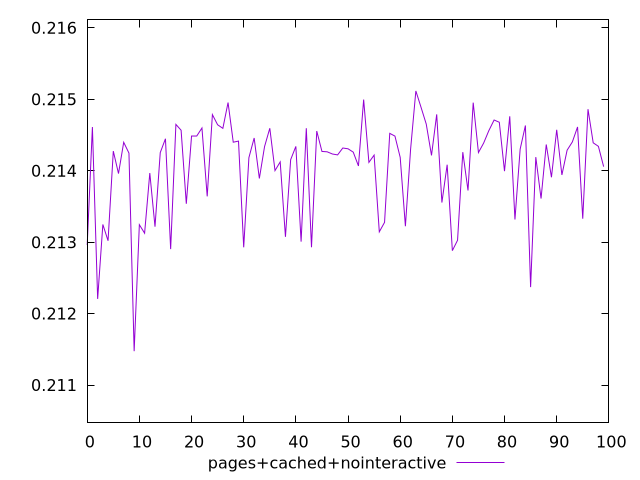
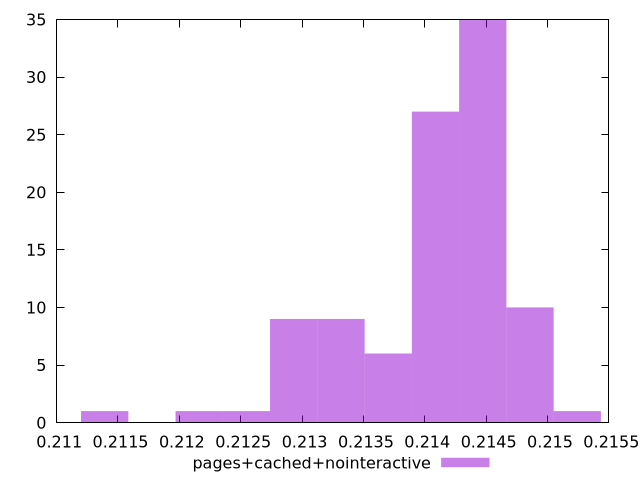
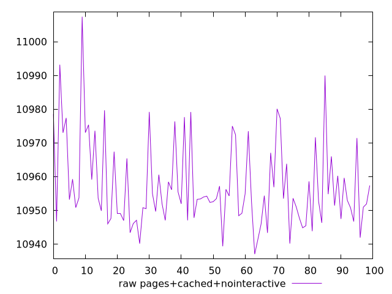
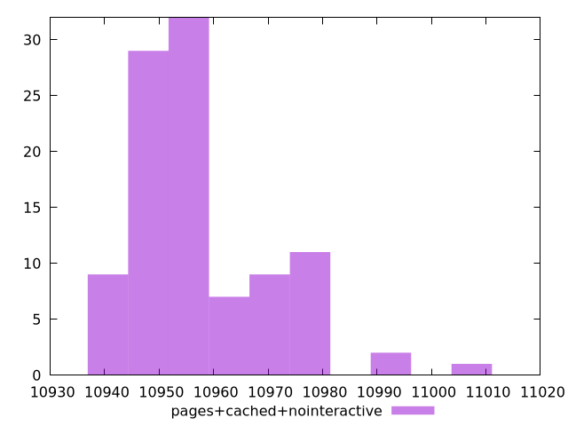

# Report pages+cached+nointeractive

[parent..](./..)  


## Scores

  

## Score Histogram

  

## Score Indicators

```yaml
min: 0.21147431610455303
max: 0.2151152930655354
range: 0.0036409769609823672
mean: 0.21405814737971202
median: 0.21425919440929256
stdev: 0.0006723572567248186
skewness: -1.1954889235484922
eccentricity: 1.4414170001358735
quanta: 100
quantaRatio: 1
p90range: 0.0019745221311930905
p90stdev: 0.214280253167303
p90eccentricity: 1.4414170001358735
p90quanta: 90
p90quantaRatio: 1
outlandishness: 0.9987753264339774

```

## Raw Values

  

## Raw Values Histogram

  

## Raw Indicators

```yaml
min: 10937.018799999996
max: 11007.419999999998
range: 70.40120000000206
mean: 10957.360679999998
median: 10953.468850000001
stdev: 12.979328668887412
skewness: 1.2041750950520511
eccentricity: 1.4399592210650602
quanta: 100
quantaRatio: 1
p90range: 38.056500000006054
p90stdev: 10953.06345
p90eccentricity: 1.4399592210650602
p90quanta: 90
p90quantaRatio: 1
outlandishness: 1.0004631029666025

```

<style>
  img {
    max-width: 80%;
  }
</style>
      
