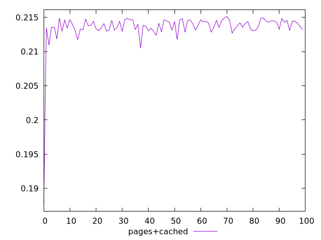
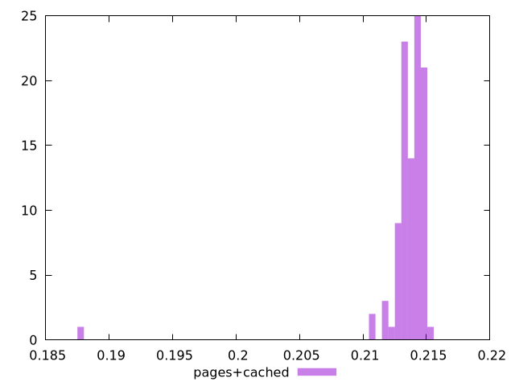
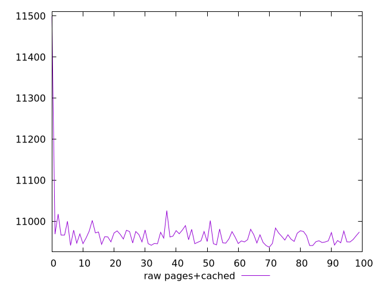
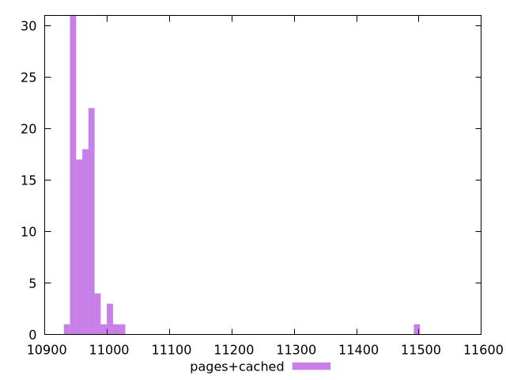

# Report pages+cached

[parent..](./..)  


## Scores

  

## Score Histogram

  

## Score Indicators

```yaml
min: 0.18764897137840159
max: 0.21511107483562297
range: 0.027462103457221387
mean: 0.21352123846756627
median: 0.21382538063262083
stdev: 0.0027416514998369135
skewness: -8.408142391106598
eccentricity: 0.7006676193659414
quanta: 100
quantaRatio: 1
p90range: 0.0025028999035003885
p90stdev: 0.21388847851343853
p90eccentricity: 0.7006676193659414
p90quanta: 90
p90quantaRatio: 1
outlandishness: 0.9967877899559994

```

## Raw Values

  

## Raw Values Histogram

  

## Raw Indicators

```yaml
min: 10937.099700000002
max: 11499.187000000002
range: 562.0872999999992
mean: 10968.052577000006
median: 10961.828700000002
stdev: 55.9630430957591
skewness: 8.551460480629014
eccentricity: 0.674105050639456
quanta: 100
quantaRatio: 1
p90range: 48.32119999999668
p90stdev: 10960.6119
p90eccentricity: 0.674105050639456
p90quanta: 90
p90quantaRatio: 1
outlandishness: 1.0012720972314035

```

<style>
  img {
    max-width: 80%;
  }
</style>
      
