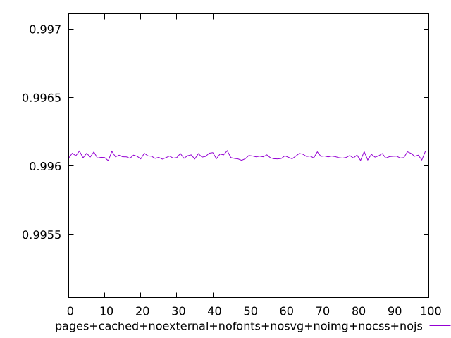
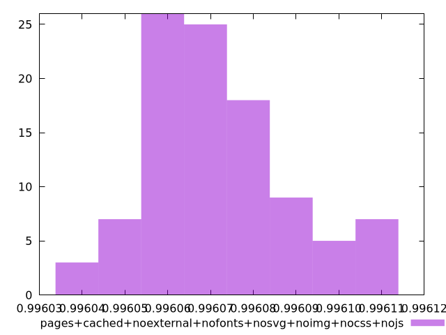

# Report pages+cached+noexternal+nofonts+nosvg+noimg+nocss+nojs

[parent..](./..)  


## Scores

  

## Score Histogram

  

## Score Indicators

```yaml
min: 0.9960400057423351
max: 0.9961130073775291
range: 0.00007300163519396996
mean: 0.9960721270960164
median: 0.9960700912740976
stdev: 0.000016569402848512446
skewness: 0.5560200301712234
eccentricity: 1.5721144399697127
quanta: 99
quantaRatio: 0.99
p90range: 0.00005592344808025285
p90stdev: 0.9960684686724686
p90eccentricity: 1.5721144399697127
p90quanta: 89
p90quantaRatio: 0.9888888888888889
outlandishness: 1.0000049135652864

```

## Raw Values

  

## Raw Values Histogram

  

## Raw Indicators

```yaml
min: 1506.9898000000003
max: 1510.4590000000003
range: 3.4692000000000007
mean: 1508.9373759999999
median: 1509.0353
stdev: 0.787444032947104
skewness: -0.5632224666910123
eccentricity: 1.5712913530743358
quanta: 99
quantaRatio: 0.99
p90range: 2.654600000000073
p90stdev: 1509.1122999999998
p90eccentricity: 1.5712913530743358
p90quanta: 89
p90quantaRatio: 0.9888888888888889
outlandishness: 0.9998453754805163

```

<style>
  img {
    max-width: 80%;
  }
</style>
      
