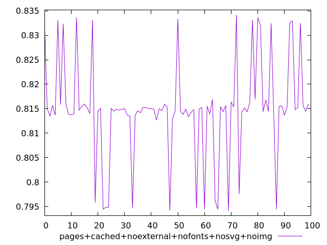
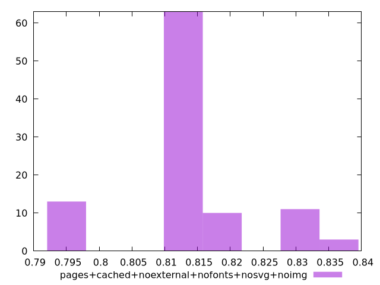
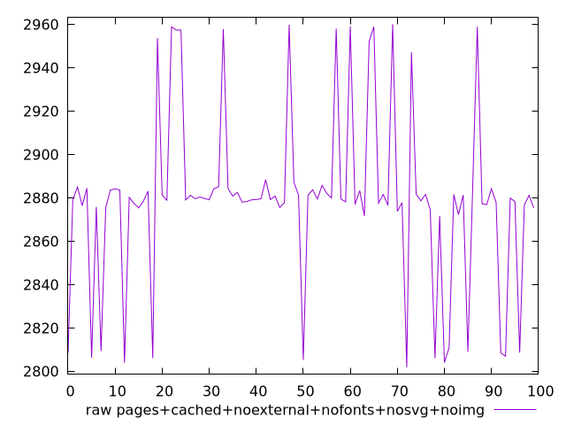
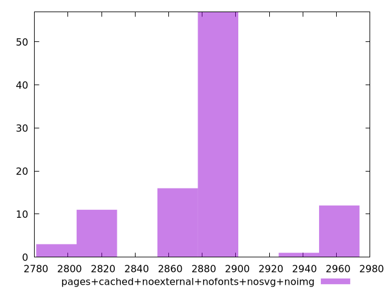

# Report pages+cached+noexternal+nofonts+nosvg+noimg

[parent..](./..)  


## Scores

  

## Score Histogram

  

## Score Indicators

```yaml
min: 0.7941437714502708
max: 0.8341683683791558
range: 0.04002459692888494
mean: 0.8147994006283475
median: 0.8149214485141538
stdev: 0.009893448322323304
skewness: -0.1809142112548032
eccentricity: 1.1365756105982168
quanta: 100
quantaRatio: 1
p90range: 0.03832913750871392
p90stdev: 0.8150146575589337
p90eccentricity: 1.1365756105982168
p90quanta: 90
p90quantaRatio: 1
outlandishness: 0.9944954223411442

```

## Raw Values

  

## Raw Values Histogram

  

## Raw Indicators

```yaml
min: 2801.8191000000006
max: 2960.146499999999
range: 158.3273999999983
mean: 2879.6227830000003
median: 2879.5225250000003
stdev: 39.11521351260607
skewness: 0.10221058216236348
eccentricity: 1.13732816479869
quanta: 100
quantaRatio: 1
p90range: 153.49364999999943
p90stdev: 2879.1858999999995
p90eccentricity: 1.13732816479869
p90quanta: 90
p90quantaRatio: 1
outlandishness: 1.0049170321389618

```

<style>
  img {
    max-width: 80%;
  }
</style>
      
