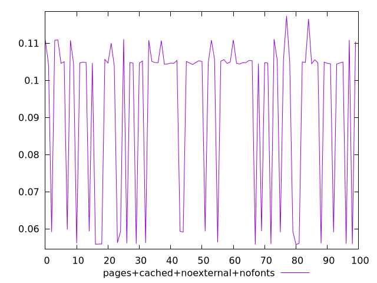
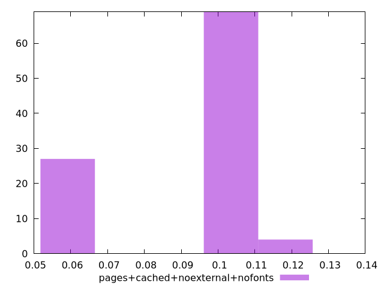
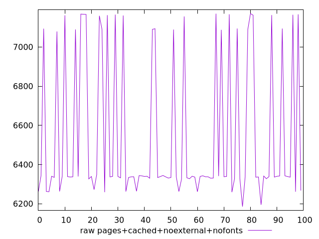
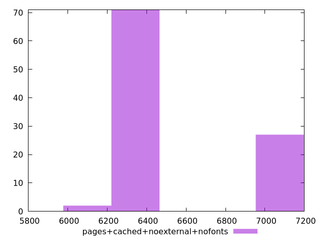

# Report pages+cached+noexternal+nofonts

[parent..](./..)  


## Scores

  

## Score Histogram

  

## Score Indicators

```yaml
min: 0.05574573939475902
max: 0.11731416104583847
range: 0.06156842165107945
mean: 0.09302654264432803
median: 0.1046833190808796
stdev: 0.021855579451499022
skewness: -0.9942088176836787
eccentricity: 1.2798415339661924
quanta: 100
quantaRatio: 1
p90range: 0.06122649356906312
p90stdev: 0.10476683979546761
p90eccentricity: 1.2798415339661924
p90quanta: 90
p90quantaRatio: 1
outlandishness: 0.9168940069259413

```

## Raw Values

  

## Raw Values Histogram

  

## Raw Indicators

```yaml
min: 6185.3243
max: 7170.52905
range: 985.2047499999999
mean: 6539.476909000003
median: 6338.700325000001
stdev: 363.3860363510951
skewness: 1.0199641122752134
eccentricity: 1.2645421123337524
quanta: 100
quantaRatio: 1
p90range: 977.2308000000003
p90stdev: 6337.630599999999
p90eccentricity: 1.2645421123337524
p90quanta: 90
p90quantaRatio: 1
outlandishness: 1.0216624902583145

```

<style>
  img {
    max-width: 80%;
  }
</style>
      
