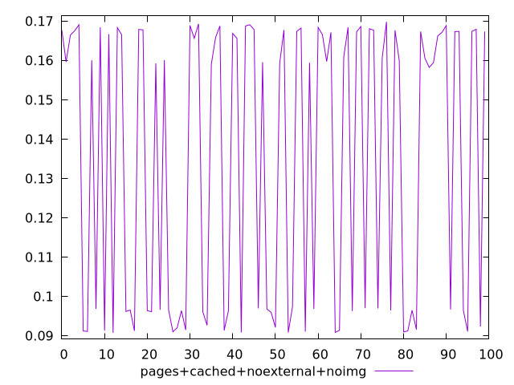
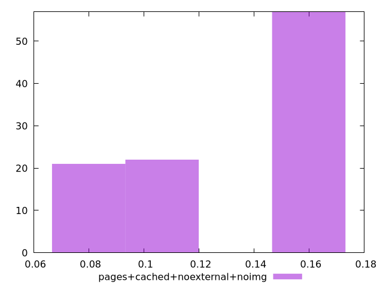
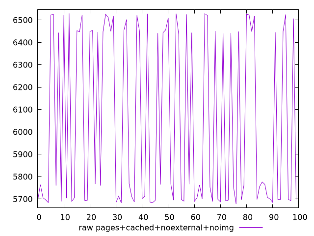
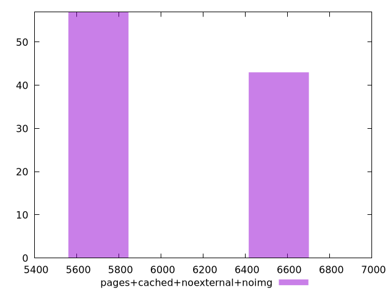

# Report pages+cached+noexternal+noimg

[parent..](./..)  


## Scores

  

## Score Histogram

  

## Score Indicators

```yaml
min: 0.09074799393538618
max: 0.16981000368034238
range: 0.0790620097449562
mean: 0.13481085310217295
median: 0.1595798529180353
stdev: 0.0355866699484523
skewness: -0.27258556818449897
eccentricity: 1.7803476110888128
quanta: 100
quantaRatio: 1
p90range: 0.0785706333893097
p90stdev: 0.1603290961597738
p90eccentricity: 1.7803476110888128
p90quanta: 90
p90quantaRatio: 1
outlandishness: 0.9314608204422477

```

## Raw Values

  

## Raw Values Histogram

  

## Raw Indicators

```yaml
min: 5677.471
max: 6529.4758
range: 852.0048000000006
mean: 6044.032191999998
median: 5764.056299999999
stdev: 382.74365303841563
skewness: 0.28430805248517793
eccentricity: 1.7702937373908405
quanta: 100
quantaRatio: 1
p90range: 844.8216000000011
p90stdev: 5757.550724999999
p90eccentricity: 1.7702937373908405
p90quanta: 90
p90quantaRatio: 1
outlandishness: 1.0179706174519596

```

<style>
  img {
    max-width: 80%;
  }
</style>
      
