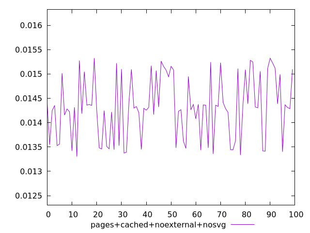
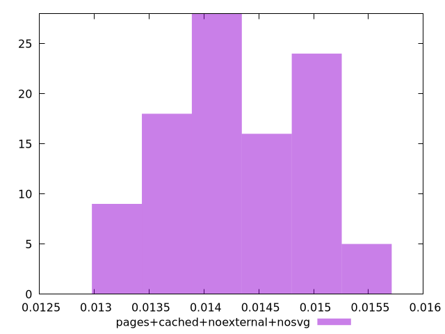
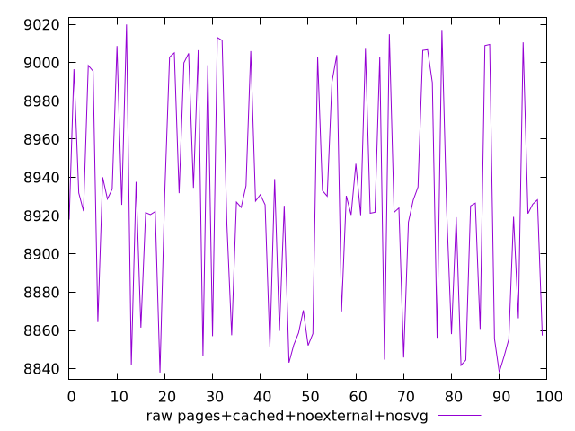
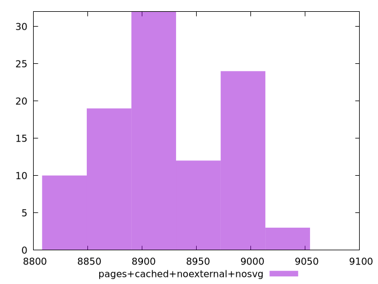

# Report pages+cached+noexternal+nosvg

[parent..](./..)  


## Scores

  

## Score Histogram

  

## Score Indicators

```yaml
min: 0.01330480788092775
max: 0.015323794615359376
range: 0.002018986734431627
mean: 0.014316352241951042
median: 0.01431491604988297
stdev: 0.0006343815749748023
skewness: -0.01874461046844942
eccentricity: 1.5668542792137639
quanta: 100
quantaRatio: 1
p90range: 0.0018525036498617808
p90stdev: 0.014313121793932876
p90eccentricity: 1.5668542792137639
p90quanta: 90
p90quantaRatio: 1
outlandishness: 1.0029845023568862

```

## Raw Values

  

## Raw Values Histogram

  

## Raw Indicators

```yaml
min: 8837.979899999998
max: 9019.975449999998
range: 181.99554999999964
mean: 8926.838573500005
median: 8925.693075
stdev: 57.18597331840502
skewness: 0.07532279987259327
eccentricity: 1.565930066476306
quanta: 100
quantaRatio: 1
p90range: 166.3839999999982
p90stdev: 8925.42525
p90eccentricity: 1.565930066476306
p90quanta: 90
p90quantaRatio: 1
outlandishness: 1.0004453948578327

```

<style>
  img {
    max-width: 80%;
  }
</style>
      
