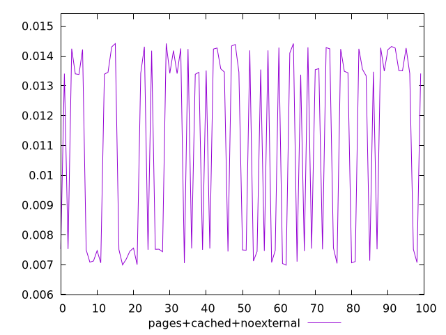
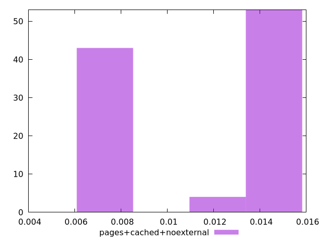
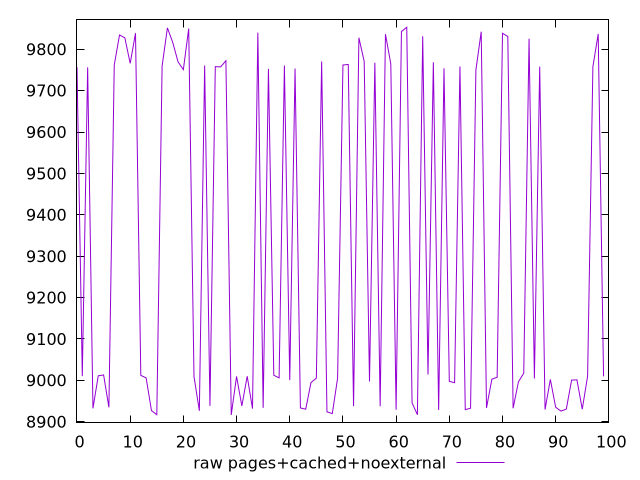
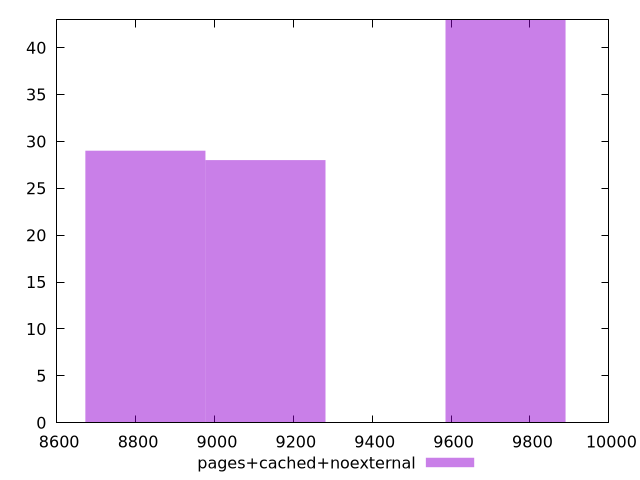

# Report pages+cached+noexternal

[parent..](./..)  


## Scores

  

## Score Histogram

  

## Score Indicators

```yaml
min: 0.006984183856467874
max: 0.014417794319265542
range: 0.0074336104627976685
mean: 0.011056261202742456
median: 0.013407378746612103
stdev: 0.0032534360944821254
skewness: -0.26089306554545133
eccentricity: 1.7694788114156337
quanta: 100
quantaRatio: 1
p90range: 0.007332905693691494
p90stdev: 0.013425594203337554
p90eccentricity: 1.7694788114156337
p90quanta: 90
p90quantaRatio: 1
outlandishness: 0.9238866779725052

```

## Raw Values

  

## Raw Values Histogram

  

## Raw Indicators

```yaml
min: 8916.46875
max: 9853.073249999998
range: 936.6044999999976
mean: 9321.364683
median: 9010.078675
stdev: 409.4679326765288
skewness: 0.2790506025562303
eccentricity: 1.760681148551707
quanta: 100
quantaRatio: 1
p90range: 918.0282500000012
p90stdev: 9008.329275
p90eccentricity: 1.760681148551707
p90quanta: 90
p90quantaRatio: 1
outlandishness: 1.01255354979479

```

<style>
  img {
    max-width: 80%;
  }
</style>
      
