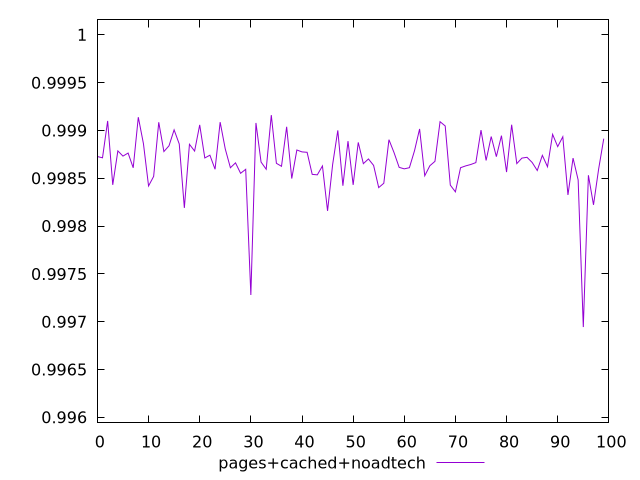
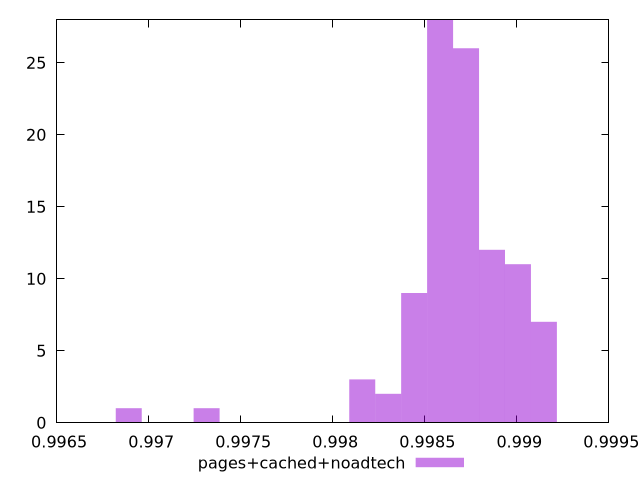
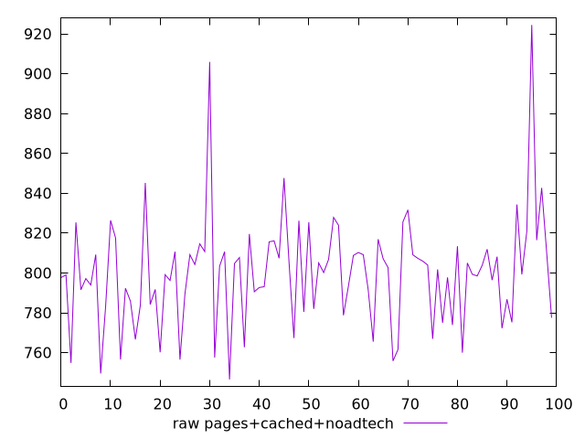
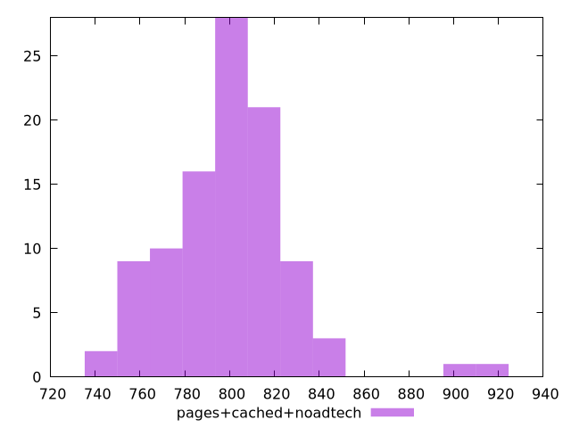

# Report pages+cached+noadtech

[parent..](./..)  


## Scores

  

## Score Histogram

  

## Score Indicators

```yaml
min: 0.9969441408137358
max: 0.9991608015696941
range: 0.0022166607559582774
mean: 0.9986821672464052
median: 0.9986819133061621
stdev: 0.00031104513221649256
skewness: -2.5205486565272026
eccentricity: 1.275669693611857
quanta: 100
quantaRatio: 1
p90range: 0.0007606976258696108
p90stdev: 0.9986819133061621
p90eccentricity: 1.275669693611857
p90quanta: 90
p90quantaRatio: 1
outlandishness: 0.9999455183047086

```

## Raw Values

  

## Raw Values Histogram

  

## Raw Indicators

```yaml
min: 746.5239999999998
max: 924.4960000000003
range: 177.97200000000055
mean: 799.9263200000003
median: 802.2180000000001
stdev: 27.51536120310984
skewness: 1.1771901579221242
eccentricity: 1.40569624779733
quanta: 100
quantaRatio: 1
p90range: 85.1600000000011
p90stdev: 803.0480000000002
p90eccentricity: 1.40569624779733
p90quanta: 90
p90quantaRatio: 1
outlandishness: 1.0012160197988602

```

<style>
  img {
    max-width: 80%;
  }
</style>
      
