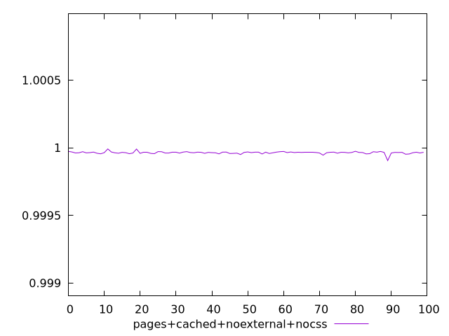
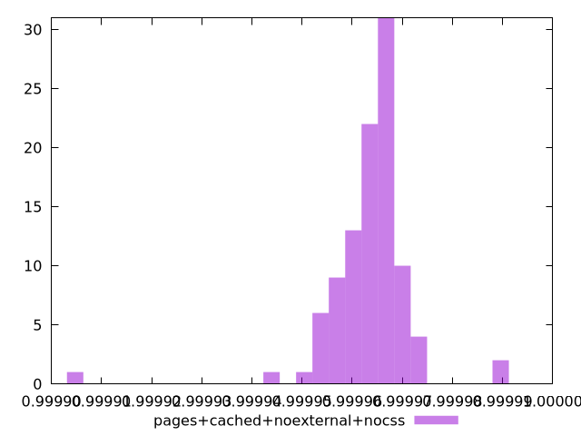
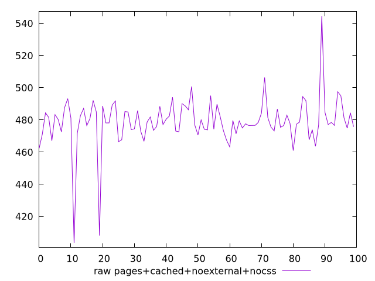
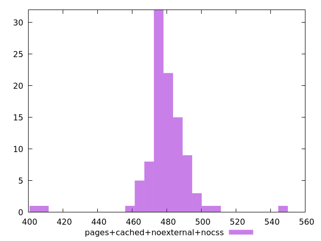

# Report pages+cached+noexternal+nocss

[parent..](./..)  


## Scores

  

## Score Histogram

  

## Score Indicators

```yaml
min: 0.9999050328384271
max: 0.9999911809529832
range: 0.00008614811455609495
mean: 0.9999636487164969
median: 0.9999648160028816
stdev: 0.000008693497893194719
skewness: -2.6147050113874974
eccentricity: 1.1474313935128755
quanta: 99
quantaRatio: 0.99
p90range: 0.00001832306056126498
p90stdev: 0.9999649073740616
p90eccentricity: 1.1474313935128755
p90quanta: 89
p90quantaRatio: 0.9888888888888889
outlandishness: 0.9999989318559809

```

## Raw Values

  

## Raw Values Histogram

  

## Raw Indicators

```yaml
min: 403.6120000000001
max: 544.6400000000001
range: 141.02800000000002
mean: 478.90852000000035
median: 478.3220000000001
stdev: 14.911006508267674
skewness: -1.3730461016281084
eccentricity: 1.1529899065141753
quanta: 100
quantaRatio: 1
p90range: 31.255999999999858
p90stdev: 478.1640000000001
p90eccentricity: 1.1529899065141753
p90quanta: 90
p90quantaRatio: 1
outlandishness: 0.9993250470400017

```

<style>
  img {
    max-width: 80%;
  }
</style>
      
