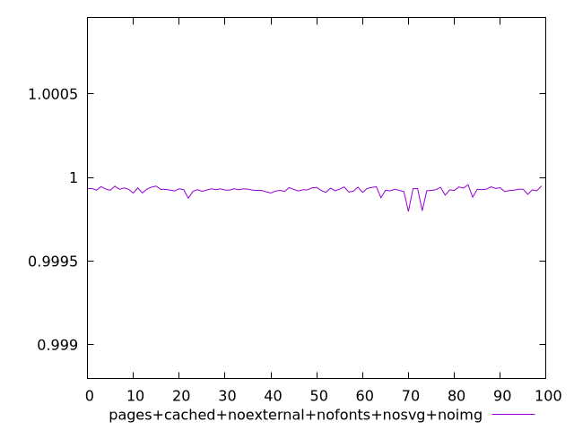
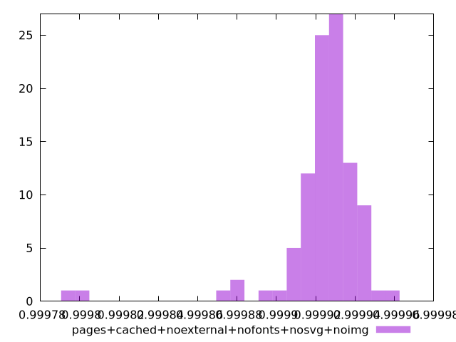
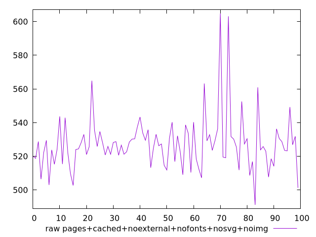
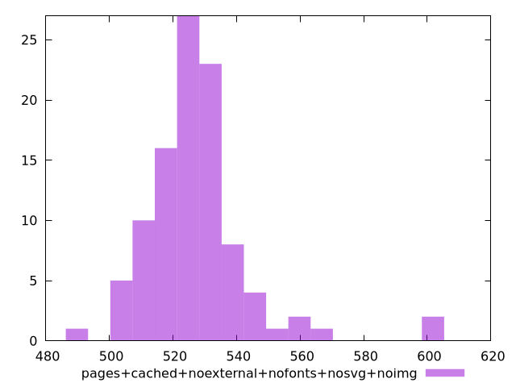

# Report pages+cached+noexternal+nofonts+nosvg+noimg

[parent..](./..)  


## Scores

  

## Score Histogram

  

## Score Indicators

```yaml
min: 0.9997967906032095
max: 0.9999567034424399
range: 0.0001599128392304472
mean: 0.999923546976834
median: 0.9999269771382092
stdev: 0.000022366245180341875
skewness: -3.605743506181112
eccentricity: 1.0658986423483339
quanta: 100
quantaRatio: 1
p90range: 0.000041722153625411984
p90stdev: 0.9999270839763108
p90eccentricity: 1.0658986423483339
p90quanta: 90
p90quantaRatio: 1
outlandishness: 0.9999921256146191

```

## Raw Values

  

## Raw Values Histogram

  

## Raw Indicators

```yaml
min: 491.1840000000001
max: 604.8239999999998
range: 113.63999999999976
mean: 527.3657199999998
median: 525.8639999999999
stdev: 16.426672507893972
skewness: 2.0609304283038115
eccentricity: 1.2607252010440797
quanta: 100
quantaRatio: 1
p90range: 42.83599999999984
p90stdev: 525.822
p90eccentricity: 1.2607252010440797
p90quanta: 90
p90quantaRatio: 1
outlandishness: 1.0073735287076926

```

<style>
  img {
    max-width: 80%;
  }
</style>
      
