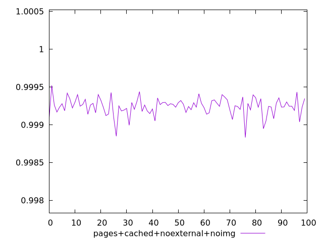
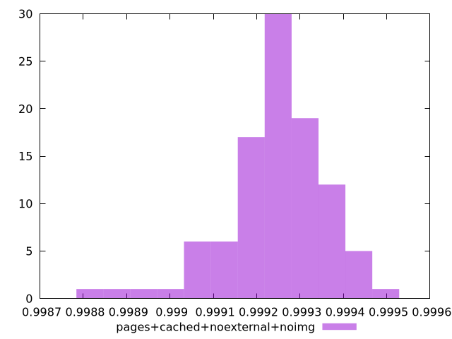
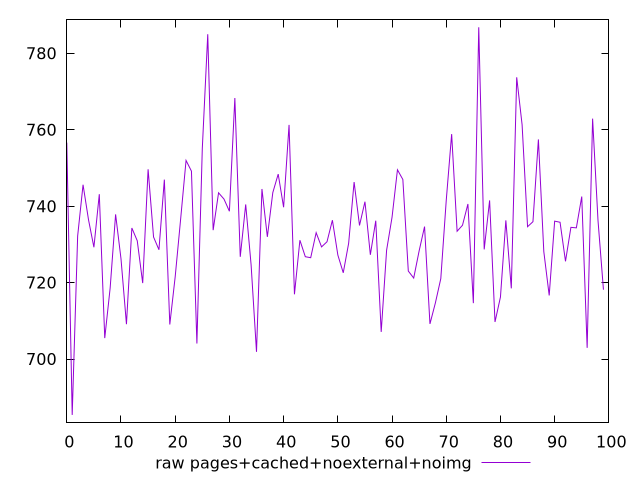
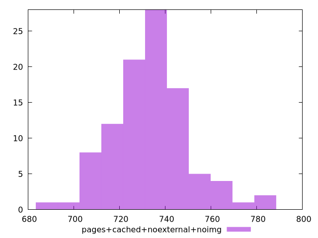

# Report pages+cached+noexternal+noimg

[parent..](./..)  


## Scores

  

## Score Histogram

  

## Score Indicators

```yaml
min: 0.998831165827192
max: 0.9995197415404649
range: 0.0006885757132728543
mean: 0.9992417057413809
median: 0.9992452304067705
stdev: 0.00011529658907544111
skewness: -0.8786216269231032
eccentricity: 1.4358229386931454
quanta: 100
quantaRatio: 1
p90range: 0.00035745083037030945
p90stdev: 0.9992500155331372
p90eccentricity: 1.4358229386931454
p90quanta: 90
p90quantaRatio: 1
outlandishness: 0.9999717190226189

```

## Raw Values

  

## Raw Values Histogram

  

## Raw Indicators

```yaml
min: 685.3880000000013
max: 786.7920000000007
range: 101.40399999999943
mean: 733.8554000000004
median: 734.2940000000001
stdev: 16.918167809783576
skewness: 0.36443282906456936
eccentricity: 1.466357366762474
quanta: 100
quantaRatio: 1
p90range: 54.18000000000063
p90stdev: 734.2940000000001
p90eccentricity: 1.466357366762474
p90quanta: 90
p90quantaRatio: 1
outlandishness: 1.0011455623993886

```

<style>
  img {
    max-width: 80%;
  }
</style>
      
