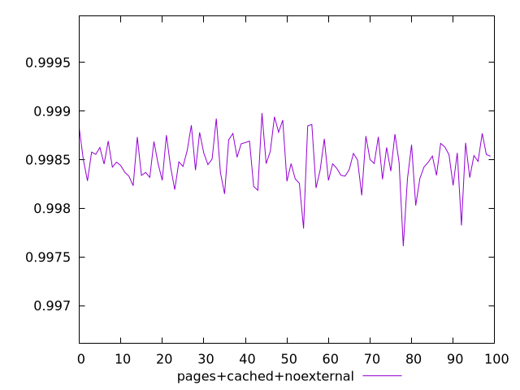
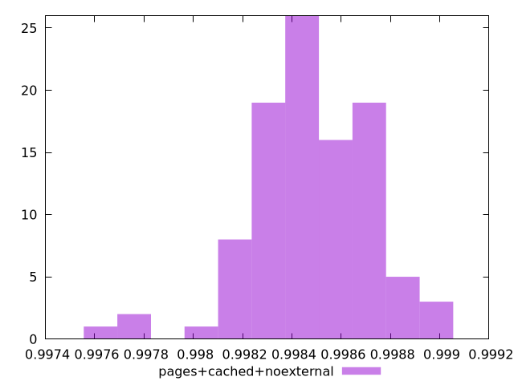
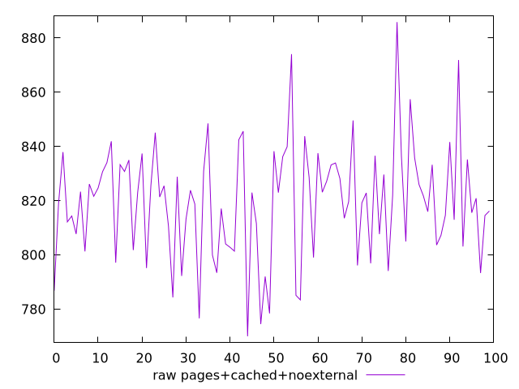
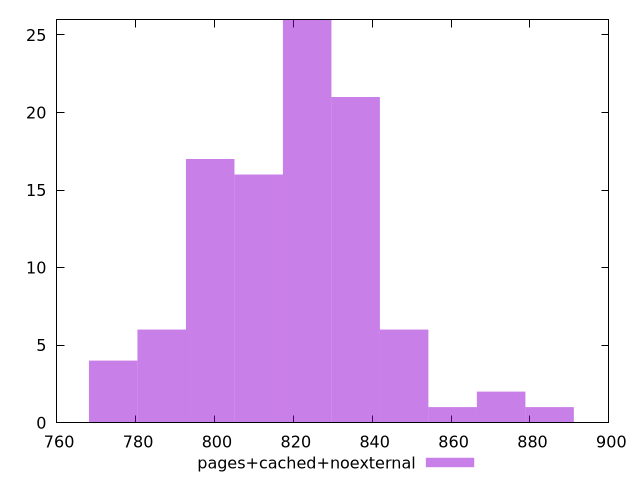

# Report pages+cached+noexternal

[parent..](./..)  


## Scores

  

## Score Histogram

  

## Score Indicators

```yaml
min: 0.9976105978692127
max: 0.9989786639992547
range: 0.0013680661300420338
mean: 0.9984845337632694
median: 0.9984734842210169
stdev: 0.00023973275898260923
skewness: -0.6120768240436055
eccentricity: 1.5245632835564347
quanta: 100
quantaRatio: 1
p90range: 0.0007135022933832946
p90stdev: 0.9984713595394328
p90eccentricity: 1.5245632835564347
p90quanta: 90
p90quantaRatio: 1
outlandishness: 0.9999971701646053

```

## Raw Values

  

## Raw Values Histogram

  

## Raw Indicators

```yaml
min: 770.0079999999998
max: 885.884
range: 115.8760000000002
mean: 819.4809600000001
median: 821.7000000000005
stdev: 21.104527257401454
skewness: 0.1518419850976244
eccentricity: 1.5477930209758444
quanta: 100
quantaRatio: 1
p90range: 64.50400000000104
p90stdev: 821.8880000000008
p90eccentricity: 1.5477930209758444
p90quanta: 90
p90quantaRatio: 1
outlandishness: 0.9989633586586374

```

<style>
  img {
    max-width: 80%;
  }
</style>
      
