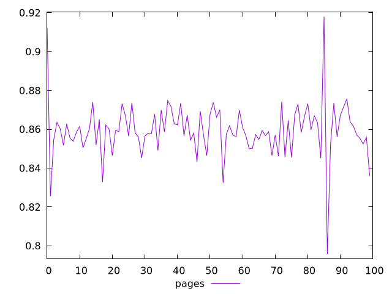
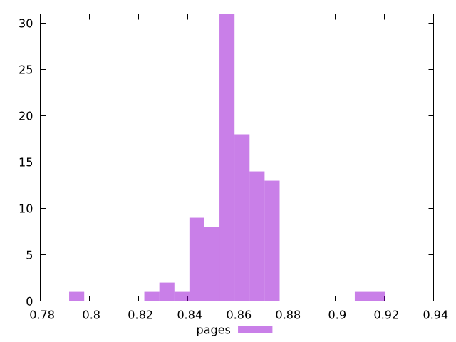
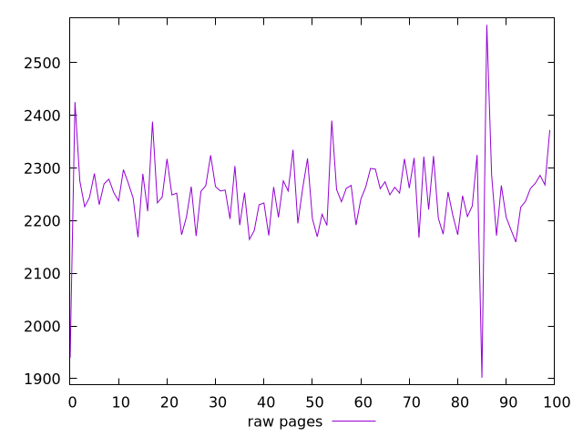
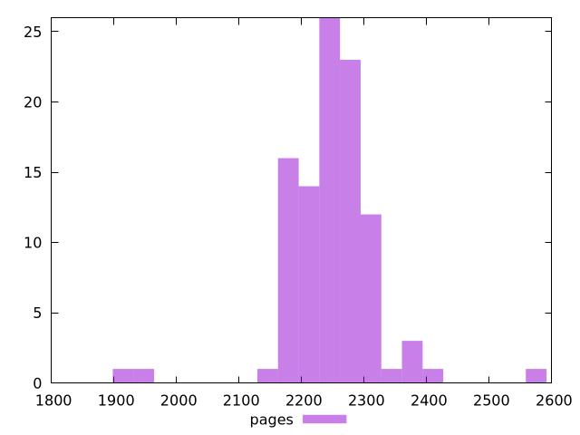

# Report pages

[parent..](./..)  


## Scores

  

## Score Histogram

  

## Score Indicators

```yaml
min: 0.7957300190824915
max: 0.917974311846788
range: 0.12224429276429649
mean: 0.8594522974159079
median: 0.8586158392450263
stdev: 0.014053843572197126
skewness: 0.04824011956502585
eccentricity: 1.2791067986391
quanta: 100
quantaRatio: 1
p90range: 0.029125800653710954
p90stdev: 0.8587066521143554
p90eccentricity: 1.2791067986391
p90quanta: 90
p90quantaRatio: 1
outlandishness: 0.9987536656239119

```

## Raw Values

  

## Raw Values Histogram

  

## Raw Indicators

```yaml
min: 1901.8560000000002
max: 2572.1599999999935
range: 670.3039999999933
mean: 2247.5168399999843
median: 2253.383999999981
stdev: 76.88436795353107
skewness: -0.5548104908773969
eccentricity: 1.2663931900805028
quanta: 100
quantaRatio: 1
p90range: 157.09999999998217
p90stdev: 2252.8959999999825
p90eccentricity: 1.2663931900805028
p90quanta: 90
p90quantaRatio: 1
outlandishness: 1.0017194635197322

```

<style>
  img {
    max-width: 80%;
  }
</style>
      
