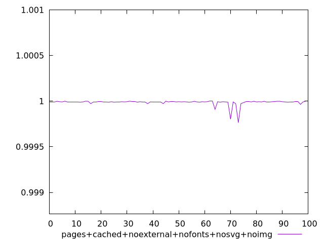
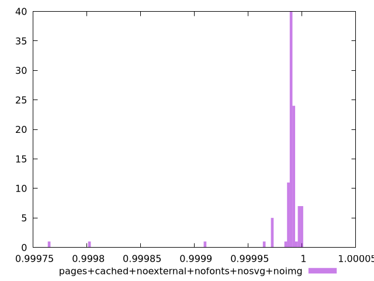
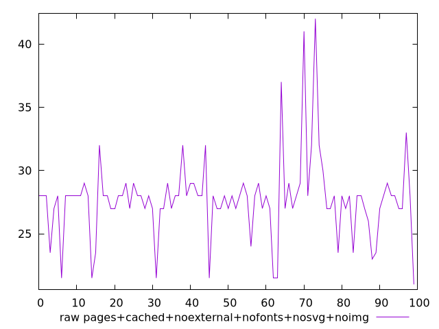
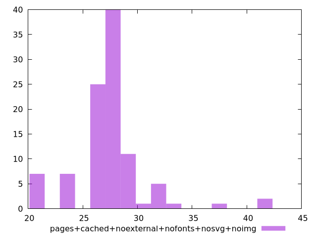

# Report pages+cached+noexternal+nofonts+nosvg+noimg

[parent..](./..)  


## Scores

  

## Score Histogram

  

## Score Indicators

```yaml
min: 0.9997636670093073
max: 0.9999993949667043
range: 0.0002357279573970139
mean: 0.9999861500189611
median: 0.9999910785021199
stdev: 0.0000308775527363757
skewness: -6.001810896262069
eccentricity: 0.5401777000163779
quanta: 15
quantaRatio: 0.15
p90range: 0.00001549354197827313
p90stdev: 0.9999910785021199
p90eccentricity: 0.5401777000163779
p90quanta: 9
p90quantaRatio: 0.1
outlandishness: 0.9999874852975643

```

## Raw Values

  

## Raw Values Histogram

  

## Raw Indicators

```yaml
min: 21
max: 42
range: 21
mean: 27.705
median: 28
stdev: 3.2094353085862335
skewness: 1.3251528927778287
eccentricity: 1.1061135865560683
quanta: 15
quantaRatio: 0.15
p90range: 10
p90stdev: 28
p90eccentricity: 1.1061135865560683
p90quanta: 10
p90quantaRatio: 0.1111111111111111
outlandishness: 0.9943690769944389

```

<style>
  img {
    max-width: 80%;
  }
</style>
      
