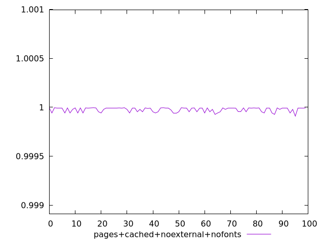
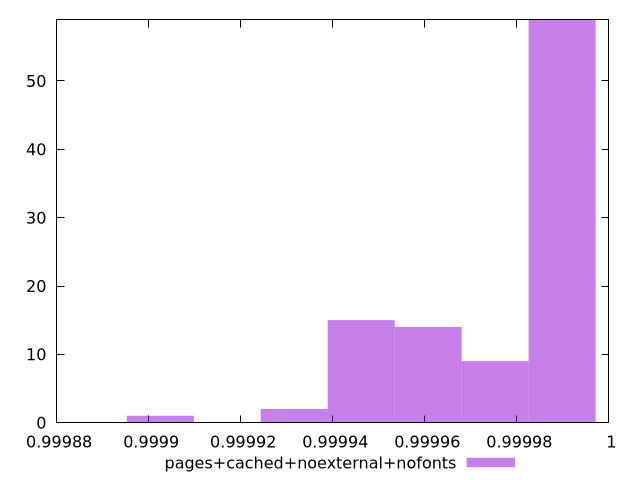
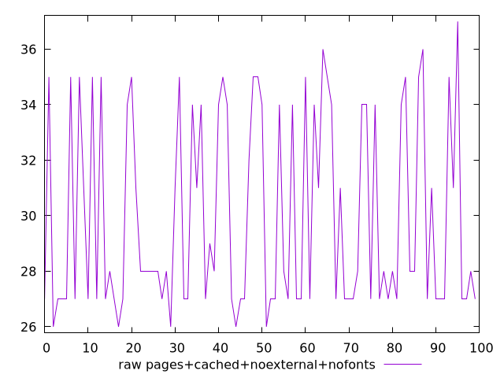
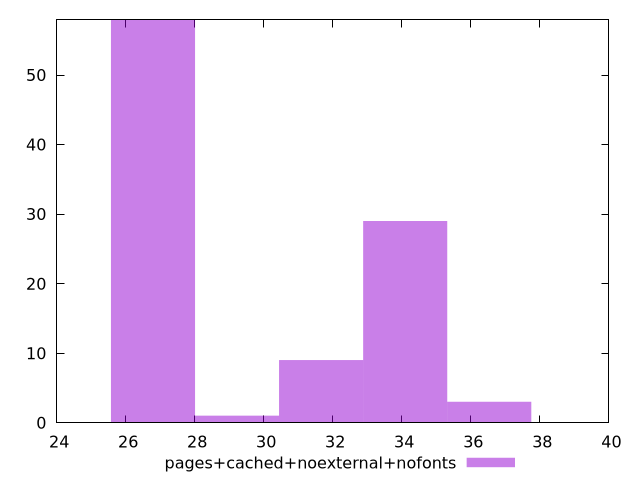

# Report pages+cached+noexternal+nofonts

[parent..](./..)  


## Scores

  

## Score Histogram

  

## Score Indicators

```yaml
min: 0.9999095029848146
max: 0.9999954072993993
range: 0.00008590431458466163
mean: 0.9999762797206797
median: 0.9999910785021199
stdev: 0.000022575711794912104
skewness: -0.9006174515630299
eccentricity: 1.515327010170198
quanta: 10
quantaRatio: 0.1
p90range: 0.00005373340944991867
p90stdev: 0.9999910785021199
p90eccentricity: 1.515327010170198
p90quanta: 8
p90quantaRatio: 0.08888888888888889
outlandishness: 0.9999909436142586

```

## Raw Values

  

## Raw Values Histogram

  

## Raw Indicators

```yaml
min: 26
max: 37
range: 11
mean: 29.95
median: 28
stdev: 3.485326383568691
skewness: 0.537867844319737
eccentricity: 1.6698579586227427
quanta: 10
quantaRatio: 0.1
p90range: 9
p90stdev: 28
p90eccentricity: 1.6698579586227427
p90quanta: 8
p90quantaRatio: 0.08888888888888889
outlandishness: 1.0416980949209025

```

<style>
  img {
    max-width: 80%;
  }
</style>
      
