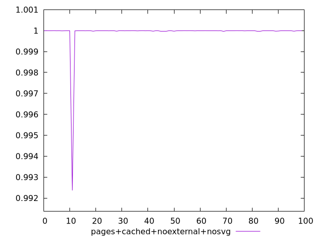
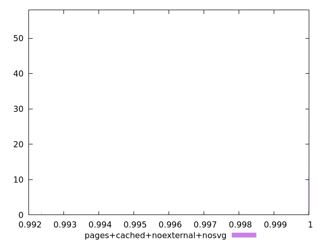
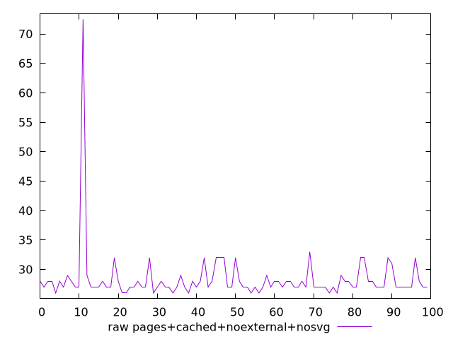
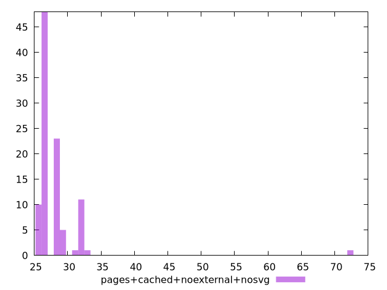

# Report pages+cached+noexternal+nosvg

[parent..](./..)  


## Scores

  

## Score Histogram

  

## Score Indicators

```yaml
min: 0.9923660363038256
max: 0.9999954072993993
range: 0.007629370995573703
mean: 0.9999137811756992
median: 0.9999935431491718
stdev: 0.0007586121336970775
skewness: -9.847972202179312
eccentricity: 0.21126686473671472
quanta: 8
quantaRatio: 0.08
p90range: 0.00003159242645800475
p90stdev: 0.9999935431491718
p90eccentricity: 0.21126686473671472
p90quanta: 7
p90quantaRatio: 0.07777777777777778
outlandishness: 0.9998486016993069

```

## Raw Values

  

## Raw Values Histogram

  

## Raw Indicators

```yaml
min: 26
max: 72.5
range: 46.5
mean: 28.335
median: 27
stdev: 4.766578961897095
skewness: 7.993406153038824
eccentricity: 0.6440677946470328
quanta: 8
quantaRatio: 0.08
p90range: 6
p90stdev: 27
p90eccentricity: 0.6440677946470328
p90quanta: 6
p90quantaRatio: 0.06666666666666667
outlandishness: 1.0642276052467246

```

<style>
  img {
    max-width: 80%;
  }
</style>
      
