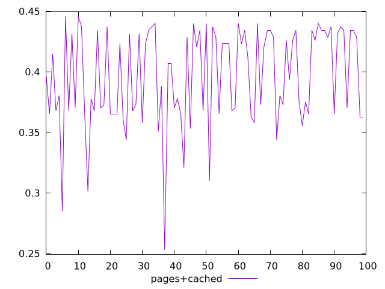
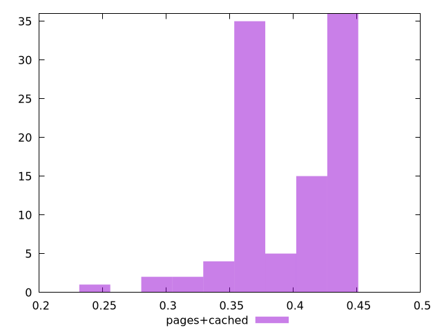
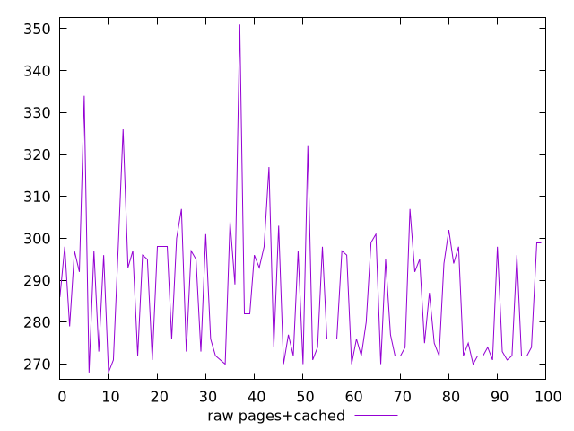
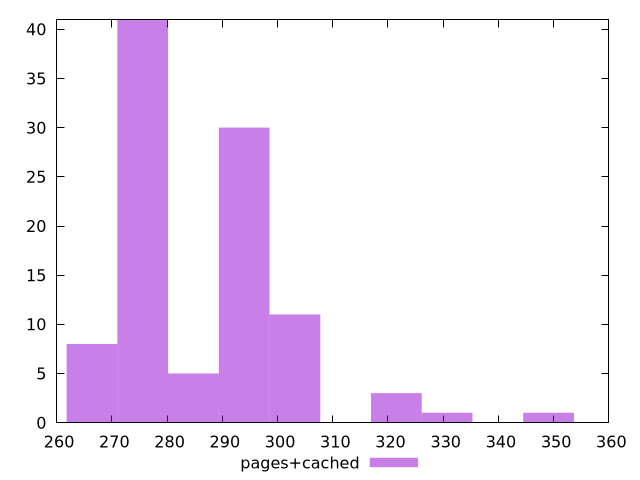

# Report pages+cached

[parent..](./..)  


## Scores

  

## Score Histogram

  

## Score Indicators

```yaml
min: 0.25302431296883876
max: 0.4458095268025572
range: 0.19278521383371844
mean: 0.3963425476122729
median: 0.40669780678037903
stdev: 0.039916560420157544
skewness: -0.817520000924123
eccentricity: 1.7488975233356001
quanta: 50
quantaRatio: 0.5
p90range: 0.08689892428774265
p90stdev: 0.4176017450758853
p90eccentricity: 1.7488975233356001
p90quanta: 41
p90quantaRatio: 0.45555555555555555
outlandishness: 0.9691472167891427

```

## Raw Values

  

## Raw Values Histogram

  

## Raw Indicators

```yaml
min: 267.9999999999982
max: 350.9999999999982
range: 83
mean: 286.5399999999999
median: 282
stdev: 15.853971111365167
skewness: 1.1199205552088465
eccentricity: 1.6929512367257689
quanta: 50
quantaRatio: 0.5
p90range: 33
p90stdev: 278
p90eccentricity: 1.6929512367257689
p90quanta: 41
p90quantaRatio: 0.45555555555555555
outlandishness: 1.0187643122690246

```

<style>
  img {
    max-width: 80%;
  }
</style>
      
