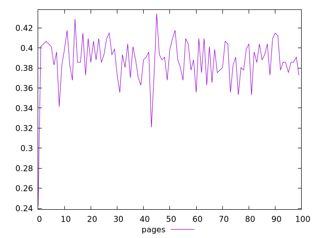
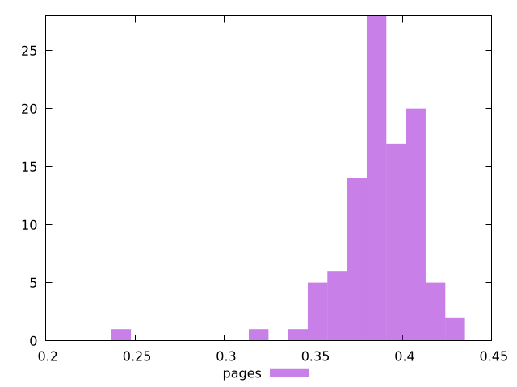
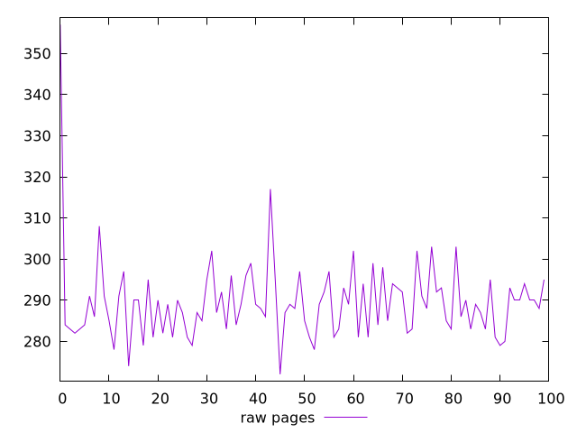

# Report pages

[parent..](./..)  


## Scores

  

## Score Histogram

  

## Score Indicators

```yaml
min: 0.2425197073059409
max: 0.4343578459053614
range: 0.1918381385994205
mean: 0.3875484531659861
median: 0.38816658760399136
stdev: 0.023701467907701806
skewness: -2.451162222631566
eccentricity: 1.3467846894853486
quanta: 49
quantaRatio: 0.49
p90range: 0.05471294881586436
p90stdev: 0.39077190547644314
p90eccentricity: 1.3467846894853486
p90quanta: 42
p90quantaRatio: 0.4666666666666667
outlandishness: 0.9810799947834061

```

## Raw Values

  

## Raw Values Histogram

  

## Raw Indicators

```yaml
min: 271.9999999999982
max: 357
range: 85.00000000000182
mean: 289.49999999999983
median: 289
stdev: 9.954396013822327
skewness: 3.2926421610019925
eccentricity: 1.2617541016612126
quanta: 49
quantaRatio: 0.49
p90range: 21.000000000003638
p90stdev: 288
p90eccentricity: 1.2617541016612126
p90quanta: 42
p90quantaRatio: 0.4666666666666667
outlandishness: 1.0112239082499295

```

<style>
  img {
    max-width: 80%;
  }
</style>
      
