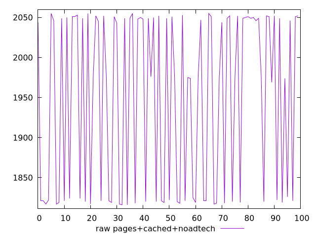
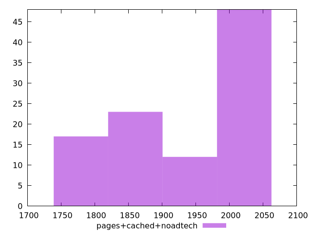

# Report pages+cached+noadtech

[parent..](./..)  


## Scores

  

## Score Histogram

  

## Score Indicators

```yaml
{}

```

## Raw Values

  

## Raw Values Histogram

  

## Raw Indicators

```yaml
min: 1816
max: 2055
range: 239
mean: 1948.93
median: 1977
stdev: 107.87513661636771
skewness: -0.2879361891227237
eccentricity: 1.8182132245869167
quanta: 27
quantaRatio: 0.27
p90range: 237
p90stdev: 2044.5
p90eccentricity: 1.8182132245869167
p90quanta: 25
p90quantaRatio: 0.2777777777777778
outlandishness: 0.9851361696560521

```

<style>
  img {
    max-width: 80%;
  }
</style>
      
