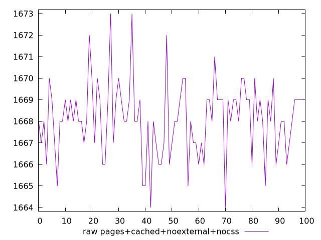
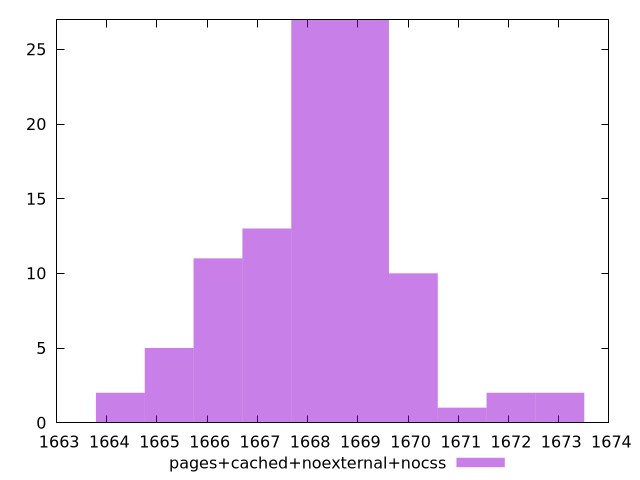

# Report pages+cached+noexternal+nocss

[parent..](./..)  


## Scores

  

## Score Histogram

  

## Score Indicators

```yaml
{}

```

## Raw Values

  

## Raw Values Histogram

  

## Raw Indicators

```yaml
min: 1664
max: 1673
range: 9
mean: 1668.1
median: 1668
stdev: 1.705872210923199
skewness: 0.12207680115029512
eccentricity: 1.4772501620365717
quanta: 10
quantaRatio: 0.1
p90range: 6
p90stdev: 1668
p90eccentricity: 1.4772501620365717
p90quanta: 7
p90quantaRatio: 0.07777777777777778
outlandishness: 0.9999600355683479

```

<style>
  img {
    max-width: 80%;
  }
</style>
      
