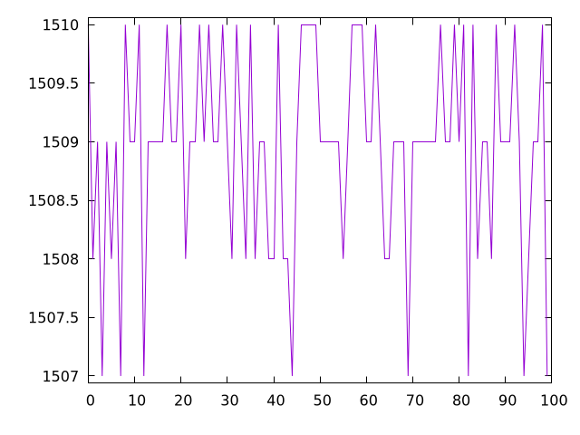
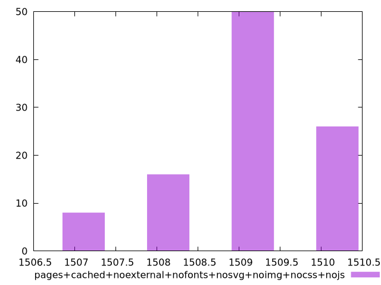

# Report pages+cached+noexternal+nofonts+nosvg+noimg+nocss+nojs

[parent..](./..)  


## Scores

  

## Score Histogram

  

## Score Indicators

```yaml
{}

```

## Raw Values

  

## Raw Values Histogram

  

## Raw Indicators

```yaml
min: 1507
max: 1510
range: 3
mean: 1508.94
median: 1509
stdev: 0.8581375181169969
skewness: -0.644423289515395
eccentricity: 1.351764694480971
quanta: 4
quantaRatio: 0.04
p90range: 2
p90stdev: 1509
p90eccentricity: 1.351764694480971
p90quanta: 3
p90quantaRatio: 0.03333333333333333
outlandishness: 0.999802686846098

```

<style>
  img {
    max-width: 80%;
  }
</style>
      
