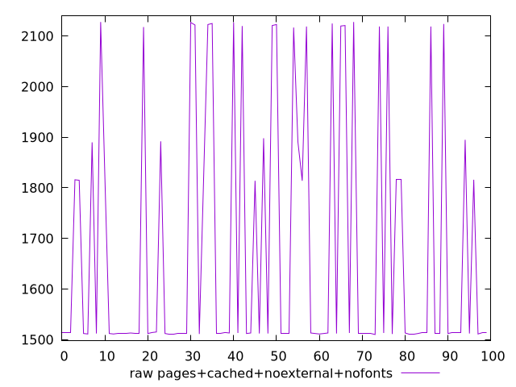
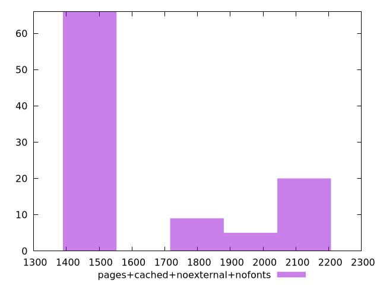

# Report pages+cached+noexternal+nofonts

[parent..](./..)  


## Scores

  

## Score Histogram

  

## Score Indicators

```yaml
{}

```

## Raw Values

  

## Raw Values Histogram

  

## Raw Indicators

```yaml
min: 1510
max: 2128
range: 618
mean: 1680.55
median: 1513
stdev: 248.23756262902683
skewness: 0.9669263710577019
eccentricity: 1.358940187888205
quanta: 25
quantaRatio: 0.25
p90range: 611
p90stdev: 1513
p90eccentricity: 1.358940187888205
p90quanta: 19
p90quantaRatio: 0.2111111111111111
outlandishness: 1.0614951979990082

```

<style>
  img {
    max-width: 80%;
  }
</style>
      
