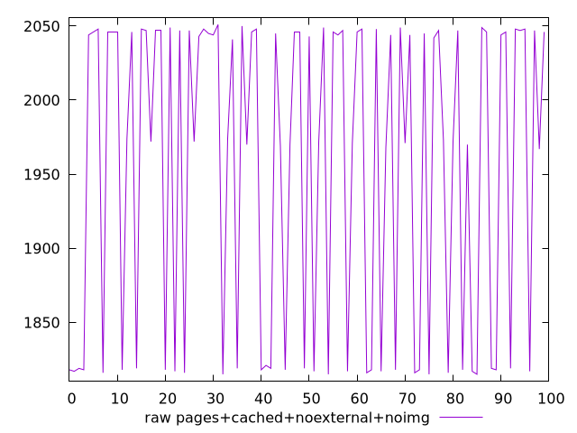
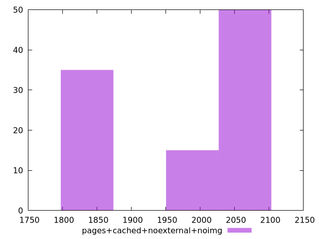

# Report pages+cached+noexternal+noimg

[parent..](./..)  


## Scores

  

## Score Histogram

  

## Score Indicators

```yaml
{}

```

## Raw Values

  

## Raw Values Histogram

  

## Raw Indicators

```yaml
min: 1815
max: 2051
range: 236
mean: 1954.93
median: 2007.5
stdev: 104.08873666252266
skewness: -0.4668706716900558
eccentricity: 1.75638600161649
quanta: 25
quantaRatio: 0.25
p90range: 234
p90stdev: 2044
p90eccentricity: 1.75638600161649
p90quanta: 23
p90quantaRatio: 0.25555555555555554
outlandishness: 0.9843592458530382

```

<style>
  img {
    max-width: 80%;
  }
</style>
      
