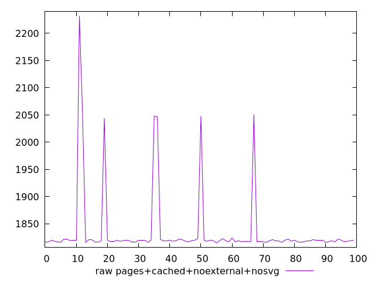
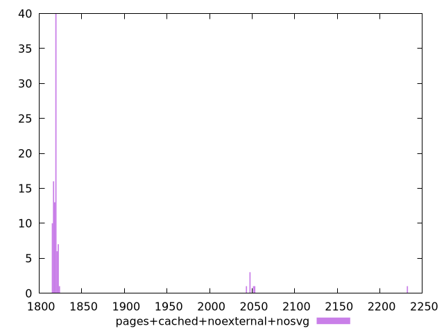

# Report pages+cached+noexternal+nosvg

[parent..](./..)  


## Scores

  

## Score Histogram

  

## Score Indicators

```yaml
{}

```

## Raw Values

  

## Raw Values Histogram

  

## Raw Indicators

```yaml
min: 1815
max: 2232
range: 417
mean: 1836.75
median: 1819
stdev: 67.48738771059375
skewness: 3.845271049950253
eccentricity: 0.5710696666060197
quanta: 16
quantaRatio: 0.16
p90range: 8
p90stdev: 1819
p90eccentricity: 0.5710696666060197
p90quanta: 9
p90quantaRatio: 0.1
outlandishness: 1.0196737228049855

```

<style>
  img {
    max-width: 80%;
  }
</style>
      
