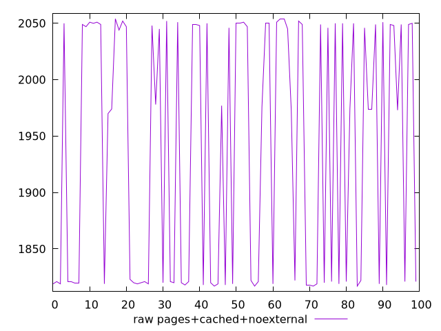
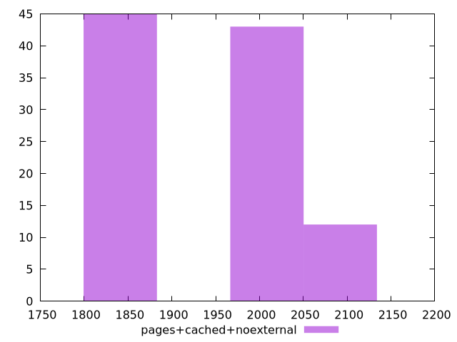

# Report pages+cached+noexternal

[parent..](./..)  


## Scores

  

## Score Histogram

  

## Score Indicators

```yaml
{}

```

## Raw Values

  

## Raw Values Histogram

  

## Raw Indicators

```yaml
min: 1817
max: 2054
range: 237
mean: 1938.49
median: 1974
stdev: 109.62002508666014
skewness: -0.10377002761961403
eccentricity: 1.8885235597815306
quanta: 23
quantaRatio: 0.23
p90range: 235
p90stdev: 2011
p90eccentricity: 1.8885235597815306
p90quanta: 21
p90quantaRatio: 0.23333333333333334
outlandishness: 0.9862842843713209

```

<style>
  img {
    max-width: 80%;
  }
</style>
      
