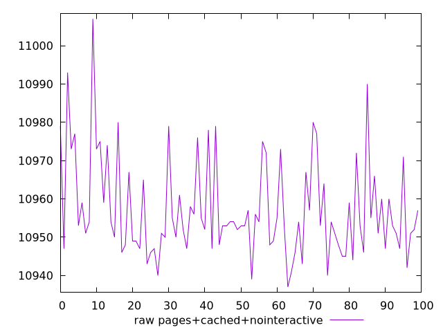
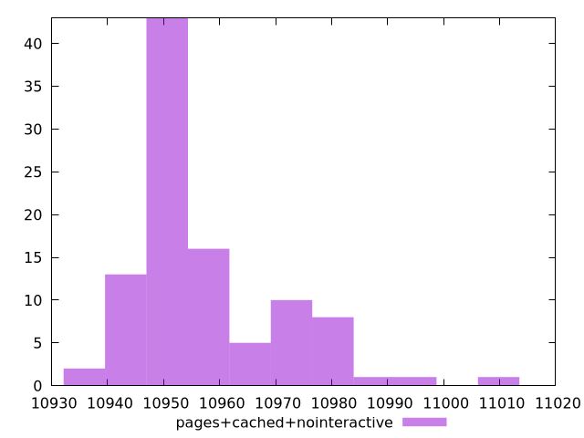

# Report pages+cached+nointeractive

[parent..](./..)  


## Scores

  

## Score Histogram

  

## Score Indicators

```yaml
{}

```

## Raw Values

  

## Raw Values Histogram

  

## Raw Indicators

```yaml
min: 10937
max: 11007
range: 70
mean: 10957.31
median: 10953
stdev: 12.961246082070955
skewness: 1.1930713784282843
eccentricity: 1.4396763923656923
quanta: 41
quantaRatio: 0.41
p90range: 38
p90stdev: 10953
p90eccentricity: 1.4396763923656923
p90quanta: 34
p90quantaRatio: 0.37777777777777777
outlandishness: 1.0004643875400612

```

<style>
  img {
    max-width: 80%;
  }
</style>
      
