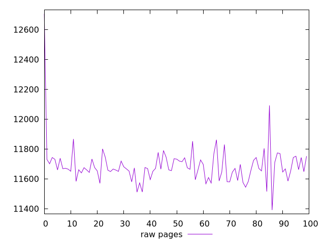
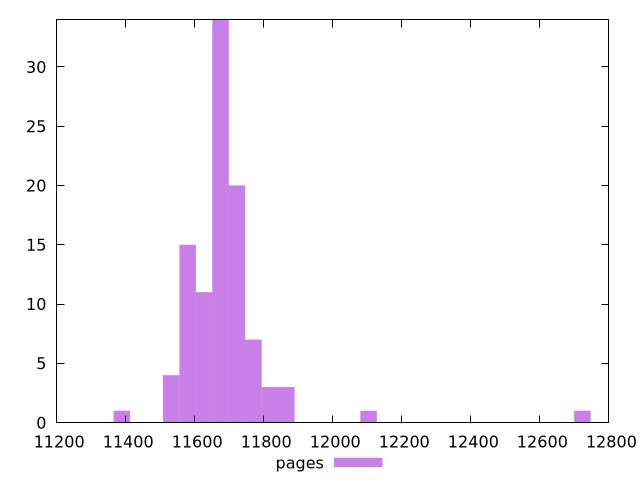

# Report pages

[parent..](./..)  


## Scores

  

## Score Histogram

  

## Score Indicators

```yaml
{}

```

## Raw Values

  

## Raw Values Histogram

  

## Raw Indicators

```yaml
min: 11391
max: 12706
range: 1315
mean: 11687.37
median: 11667
stdev: 135.60122823927517
skewness: 4.354302780273307
eccentricity: 1.0553001758029303
quanta: 81
quantaRatio: 0.81
p90range: 263
p90stdev: 11667
p90eccentricity: 1.0553001758029303
p90quanta: 71
p90quantaRatio: 0.7888888888888889
outlandishness: 1.001862725920031

```

<style>
  img {
    max-width: 80%;
  }
</style>
      
