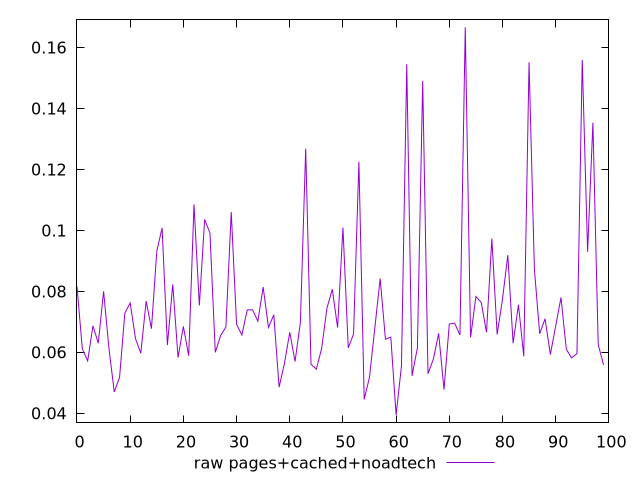
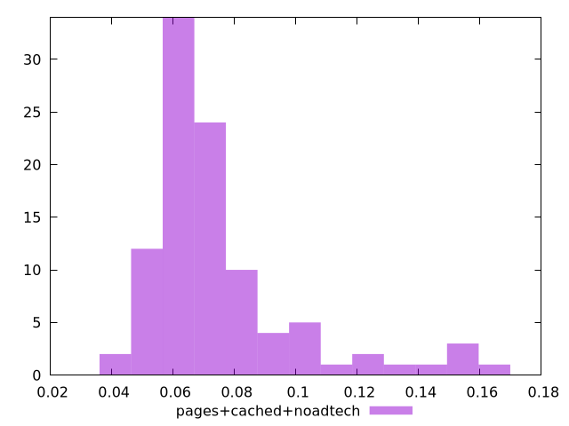

# Report pages+cached+noadtech

[parent..](./..)  


## Scores

  

## Score Histogram

  

## Score Indicators

```yaml
{}

```

## Raw Values

  

## Raw Values Histogram

  

## Raw Indicators

```yaml
min: 0.0395
max: 0.16660000000000003
range: 0.12710000000000002
mean: 0.07516199999999999
median: 0.0681
stdev: 0.025132018542090885
skewness: 1.9042561726621248
eccentricity: 1.2584743221890342
quanta: 95
quantaRatio: 0.95
p90range: 0.061399999999999996
p90stdev: 0.06639999999999999
p90eccentricity: 1.2584743221890342
p90quanta: 85
p90quantaRatio: 0.9444444444444444
outlandishness: 1.1894553076942185

```

<style>
  img {
    max-width: 80%;
  }
</style>
      
