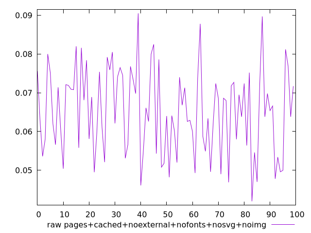
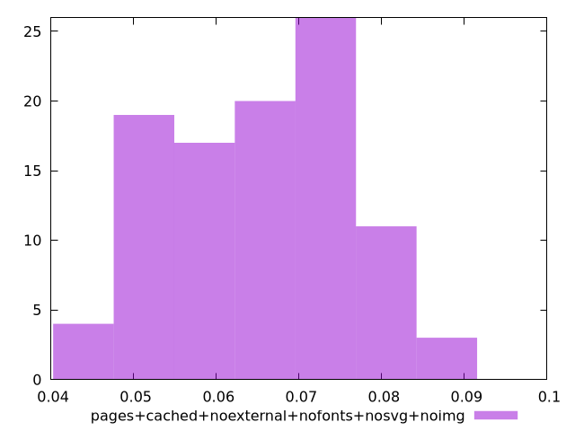

# Report pages+cached+noexternal+nofonts+nosvg+noimg

[parent..](./..)  


## Scores

  

## Score Histogram

  

## Score Indicators

```yaml
{}

```

## Raw Values

  

## Raw Values Histogram

  

## Raw Indicators

```yaml
min: 0.041999999999999996
max: 0.09050000000000001
range: 0.048500000000000015
mean: 0.065181
median: 0.06475
stdev: 0.011034026418311676
skewness: 0.02749048040803997
eccentricity: 1.6956638756047886
quanta: 91
quantaRatio: 0.91
p90range: 0.032999999999999995
p90stdev: 0.06575
p90eccentricity: 1.6956638756047886
p90quanta: 81
p90quantaRatio: 0.9
outlandishness: 0.9921000164487453

```

<style>
  img {
    max-width: 80%;
  }
</style>
      
