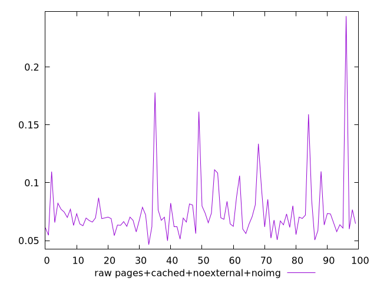
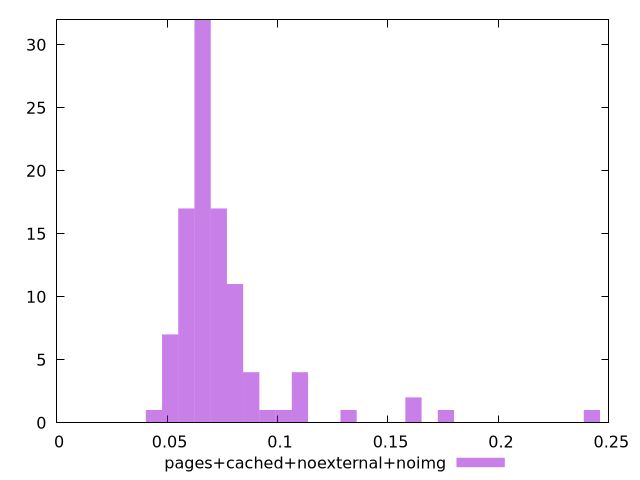

# Report pages+cached+noexternal+noimg

[parent..](./..)  


## Scores

  

## Score Histogram

  

## Score Indicators

```yaml
{}

```

## Raw Values

  

## Raw Values Histogram

  

## Raw Indicators

```yaml
min: 0.0465
max: 0.24409999999999998
range: 0.1976
mean: 0.07529999999999998
median: 0.06899999999999999
stdev: 0.027489987268094537
skewness: 3.5225046639331357
eccentricity: 1.0192802101629423
quanta: 86
quantaRatio: 0.86
p90range: 0.04809999999999999
p90stdev: 0.0675
p90eccentricity: 1.0192802101629423
p90quanta: 76
p90quantaRatio: 0.8444444444444444
outlandishness: 1.2308519410014889

```

<style>
  img {
    max-width: 80%;
  }
</style>
      
