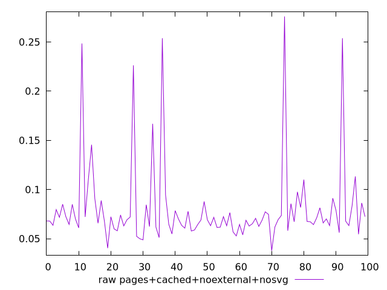
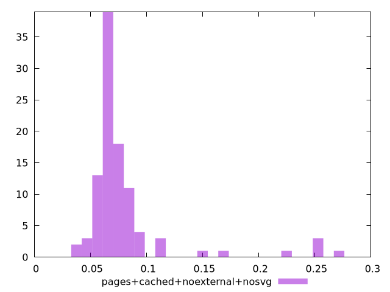

# Report pages+cached+noexternal+nosvg

[parent..](./..)  


## Scores

  

## Score Histogram

  

## Score Indicators

```yaml
{}

```

## Raw Values

  

## Raw Values Histogram

  

## Raw Indicators

```yaml
min: 0.0378
max: 0.2759
range: 0.23809999999999998
mean: 0.08054800000000001
median: 0.06885
stdev: 0.04323486435736789
skewness: 3.2319308521755037
eccentricity: 0.9221261727679254
quanta: 88
quantaRatio: 0.88
p90range: 0.061700000000000005
p90stdev: 0.06795000000000001
p90eccentricity: 0.9221261727679254
p90quanta: 79
p90quantaRatio: 0.8777777777777778
outlandishness: 1.3270670946645622

```

<style>
  img {
    max-width: 80%;
  }
</style>
      
