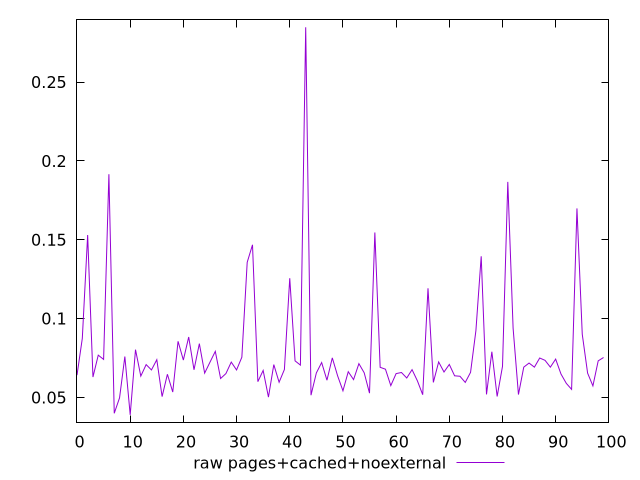
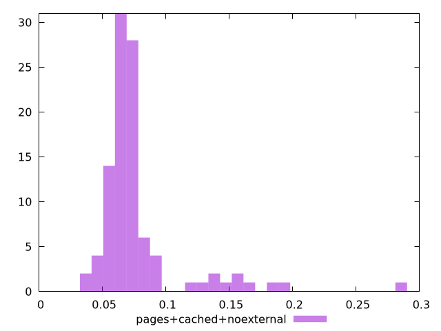

# Report pages+cached+noexternal

[parent..](./..)  


## Scores

  

## Score Histogram

  

## Score Indicators

```yaml
{}

```

## Raw Values

  

## Raw Values Histogram

  

## Raw Indicators

```yaml
min: 0.038900000000000004
max: 0.28479999999999994
range: 0.24589999999999995
mean: 0.07759900000000002
median: 0.0678
stdev: 0.0352279306658793
skewness: 3.1730321278779443
eccentricity: 1.0070986098074426
quanta: 91
quantaRatio: 0.91
p90range: 0.08029999999999997
p90stdev: 0.06725
p90eccentricity: 1.0070986098074426
p90quanta: 81
p90quantaRatio: 0.9
outlandishness: 1.323051221020618

```

<style>
  img {
    max-width: 80%;
  }
</style>
      
