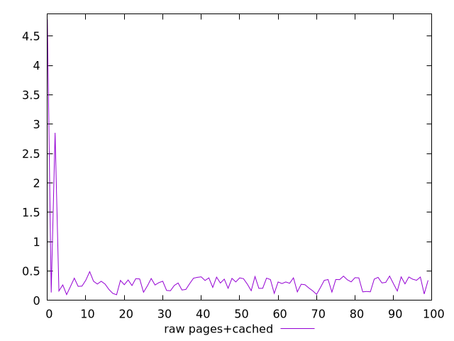
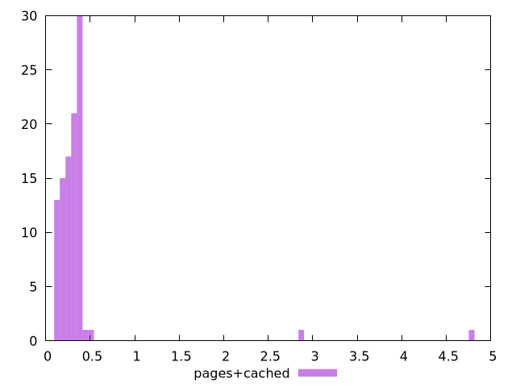

# Report pages+cached

[parent..](./..)  


## Scores

  

## Score Histogram

  

## Score Indicators

```yaml
{}

```

## Raw Values

  

## Raw Values Histogram

  

## Raw Indicators

```yaml
min: 0.0968
max: 4.784
range: 4.6872
mean: 0.356126
median: 0.3005
stdev: 0.5214036510459051
skewness: 7.2051689815789315
eccentricity: 0.5650823491722341
quanta: 99
quantaRatio: 0.99
p90range: 0.3478
p90stdev: 0.3142
p90eccentricity: 0.5650823491722341
p90quanta: 89
p90quantaRatio: 0.9888888888888889
outlandishness: 1.4040323357918931

```

<style>
  img {
    max-width: 80%;
  }
</style>
      
