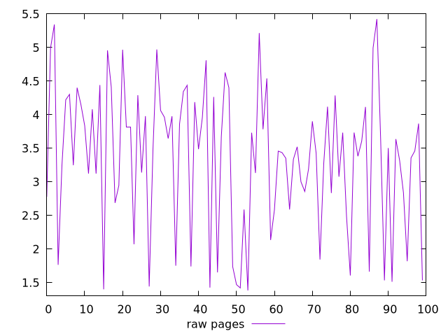

# Report pages

[parent..](./..)  


## Scores

  

## Score Histogram

  

## Score Indicators

```yaml
{}

```

## Raw Values

  

## Raw Values Histogram

  

## Raw Indicators

```yaml
min: 1.384
max: 5.4239999999999995
range: 4.039999999999999
mean: 3.357279999999999
median: 3.4865000000000004
stdev: 1.060709546294366
skewness: -0.3448748771031168
eccentricity: 1.5904825273740044
quanta: 100
quantaRatio: 1
p90range: 3.4600000000000004
p90stdev: 3.513
p90eccentricity: 1.5904825273740044
p90quanta: 90
p90quantaRatio: 1
outlandishness: 0.9519439777738393

```

<style>
  img {
    max-width: 80%;
  }
</style>
      
