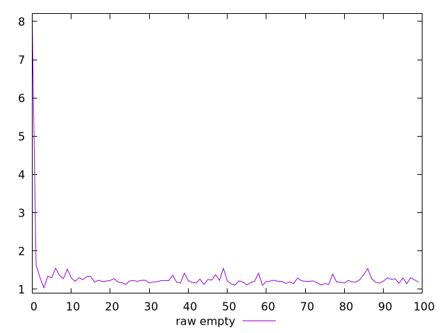
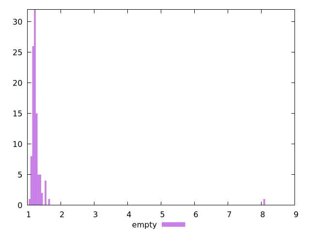

# Report empty

[parent..](./..)  


## Scores

  

## Score Histogram

  

## Score Indicators

```yaml
{}

```

## Raw Values

  

## Raw Values Histogram

  

## Raw Indicators

```yaml
min: 1.0379999999999998
max: 8.066999999999993
range: 7.028999999999993
mean: 1.3104379999999998
median: 1.219675
stdev: 0.6867017447596876
skewness: 9.522780080142281
eccentricity: 0.39816703843629303
quanta: 99
quantaRatio: 0.99
p90range: 0.3076000000000001
p90stdev: 1.2191
p90eccentricity: 0.39816703843629303
p90quanta: 89
p90quantaRatio: 0.9888888888888889
outlandishness: 1.1328822110038022

```

<style>
  img {
    max-width: 80%;
  }
</style>
      
