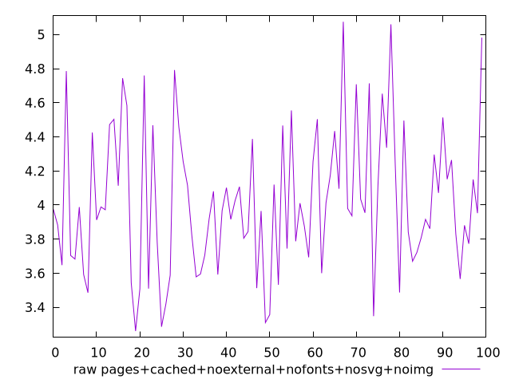
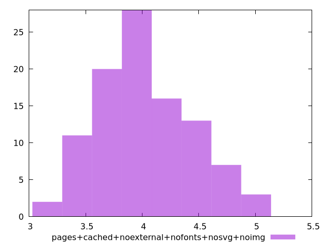

# Report pages+cached+noexternal+nofonts+nosvg+noimg

[parent..](./..)  


## Scores

  

## Score Histogram

  

## Score Indicators

```yaml
{}

```

## Raw Values

  

## Raw Values Histogram

  

## Raw Indicators

```yaml
min: 3.2605999999999997
max: 5.0754
range: 1.8148000000000004
mean: 4.020462
median: 3.9698
stdev: 0.4178486771021299
skewness: 0.45838488101530883
eccentricity: 1.5843630392497055
quanta: 100
quantaRatio: 1
p90range: 1.366
p90stdev: 3.9597999999999995
p90eccentricity: 1.5843630392497055
p90quanta: 90
p90quantaRatio: 1
outlandishness: 1.021639840172076

```

<style>
  img {
    max-width: 80%;
  }
</style>
      
