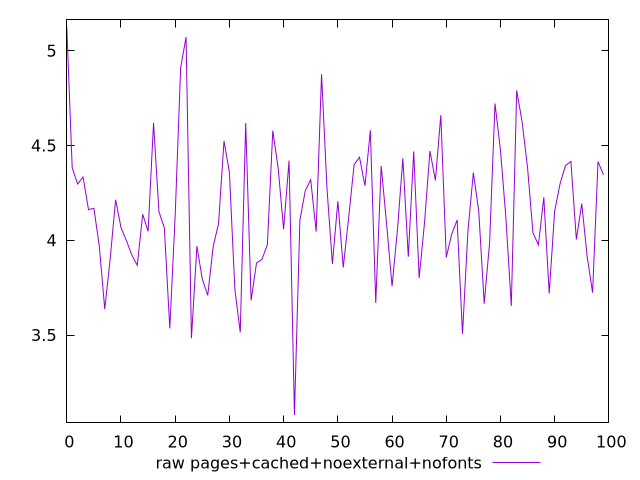
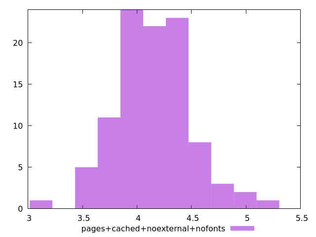

# Report pages+cached+noexternal+nofonts

[parent..](./..)  


## Scores

  

## Score Histogram

  

## Score Indicators

```yaml
{}

```

## Raw Values

  

## Raw Values Histogram

  

## Raw Indicators

```yaml
min: 3.0788
max: 5.1237
range: 2.0449
mean: 4.145370999999999
median: 4.120100000000001
stdev: 0.3539446429302188
skewness: 0.13560884098561557
eccentricity: 1.5549154676950527
quanta: 100
quantaRatio: 1
p90range: 1.0847999999999995
p90stdev: 4.120100000000001
p90eccentricity: 1.5549154676950527
p90quanta: 90
p90quantaRatio: 1
outlandishness: 1.0023429426989094

```

<style>
  img {
    max-width: 80%;
  }
</style>
      
