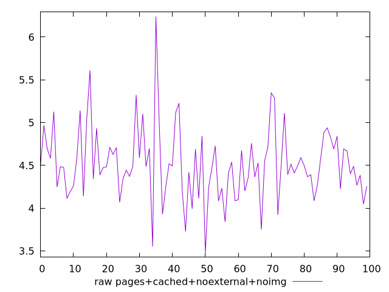
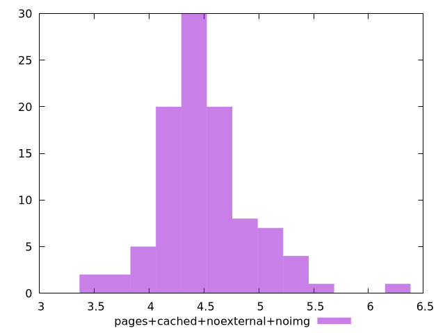

# Report pages+cached+noexternal+noimg

[parent..](./..)  


## Scores

  

## Score Histogram

  

## Score Indicators

```yaml
{}

```

## Raw Values

  

## Raw Values Histogram

  

## Raw Indicators

```yaml
min: 3.4831000000000008
max: 6.240200000000001
range: 2.7571
mean: 4.515967000000001
median: 4.487
stdev: 0.4229113235785961
skewness: 0.7166015190217979
eccentricity: 1.4413754515766948
quanta: 100
quantaRatio: 1
p90range: 1.3011
p90stdev: 4.4856
p90eccentricity: 1.4413754515766948
p90quanta: 90
p90quantaRatio: 1
outlandishness: 1.0118869828345898

```

<style>
  img {
    max-width: 80%;
  }
</style>
      
