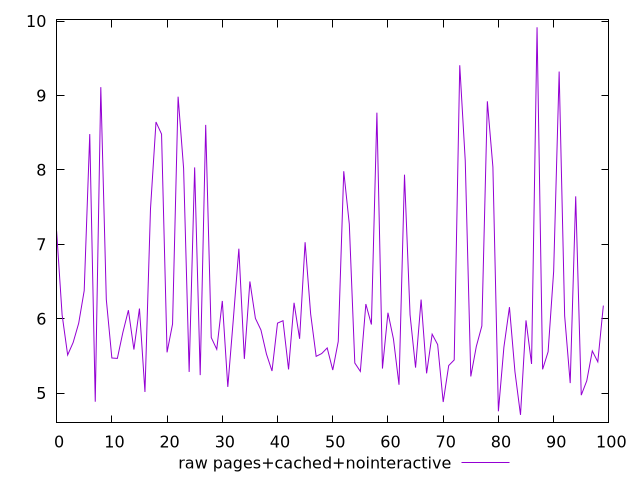
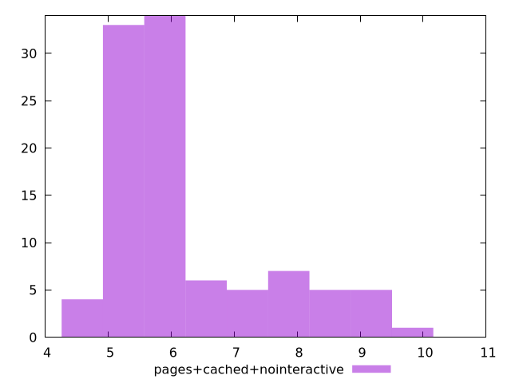

# Report pages+cached+nointeractive

[parent..](./..)  


## Scores

  

## Score Histogram

  

## Score Indicators

```yaml
{}

```

## Raw Values

  

## Raw Values Histogram

  

## Raw Indicators

```yaml
min: 4.706955205741551
max: 9.916400000000001
range: 5.2094447942584505
mean: 6.245033185845166
median: 5.8309999999999995
stdev: 1.2279862446988823
skewness: 1.2864462815649156
eccentricity: 1.4011754373377245
quanta: 100
quantaRatio: 1
p90range: 3.773344794258449
p90stdev: 5.7102
p90eccentricity: 1.4011754373377245
p90quanta: 90
p90quantaRatio: 1
outlandishness: 1.1063903012075949

```

<style>
  img {
    max-width: 80%;
  }
</style>
      
