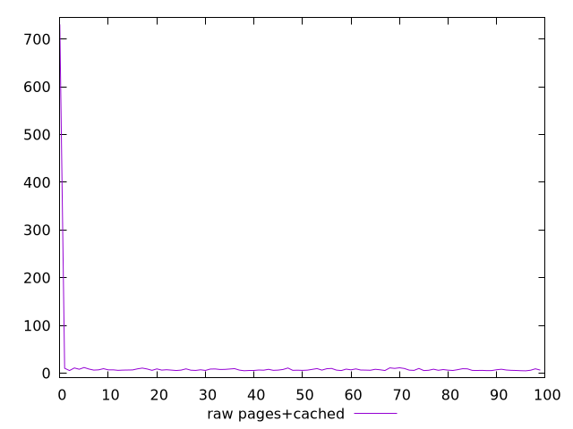
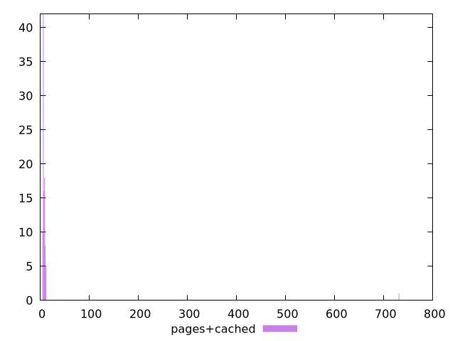

# Report pages+cached

[parent..](./..)  


## Scores

  

## Score Histogram

  

## Score Indicators

```yaml
{}

```

## Raw Values

  

## Raw Values Histogram

  

## Raw Indicators

```yaml
min: 4.9603
max: 730.832
range: 725.8717
mean: 14.602797604225616
median: 6.66095
stdev: 72.00275464809894
skewness: 9.841421367450028
eccentricity: 0.23806686847513542
quanta: 100
quantaRatio: 1
p90range: 6.253500000000002
p90stdev: 6.983560453179204
p90eccentricity: 0.23806686847513542
p90quanta: 90
p90quantaRatio: 1
outlandishness: 3.725503021617194

```

<style>
  img {
    max-width: 80%;
  }
</style>
      
