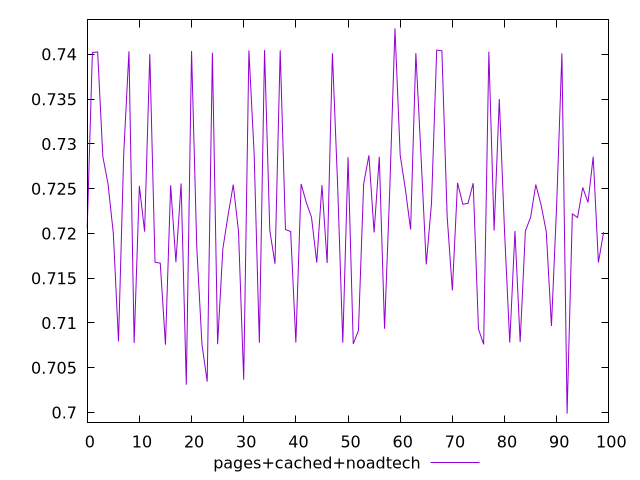
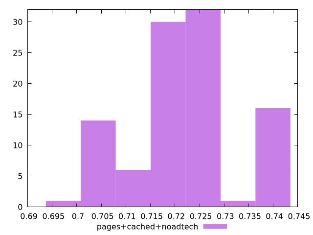
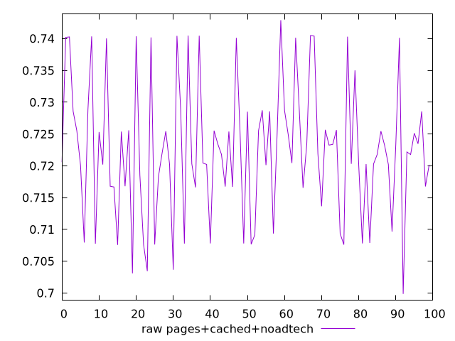

# Report pages+cached+noadtech

[parent..](./..)  


## Scores

  

## Score Histogram

  

## Score Indicators

```yaml
min: 0.6998718858472739
max: 0.7428927541618515
range: 0.04302086831457763
mean: 0.7224478136270693
median: 0.7219618528024123
stdev: 0.010562977504468144
skewness: 0.1400878988392742
eccentricity: 1.538616953683579
quanta: 100
quantaRatio: 1
p90range: 0.0327877605931256
p90stdev: 0.7218531952684444
p90eccentricity: 1.538616953683579
p90quanta: 90
p90quantaRatio: 1
outlandishness: 1.0009467908292011

```

## Raw Values

  

## Raw Values Histogram

  

## Raw Indicators

```yaml
min: 0.6998718858472739
max: 0.7428927541618515
range: 0.04302086831457763
mean: 0.7224478136270693
median: 0.7219618528024123
stdev: 0.010562977504468144
skewness: 0.1400878988392742
eccentricity: 1.538616953683579
quanta: 100
quantaRatio: 1
p90range: 0.0327877605931256
p90stdev: 0.7218531952684444
p90eccentricity: 1.538616953683579
p90quanta: 90
p90quantaRatio: 1
outlandishness: 1.0009467908292011

```

<style>
  img {
    max-width: 80%;
  }
</style>
      
