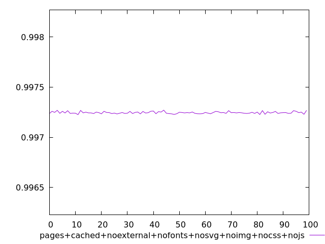
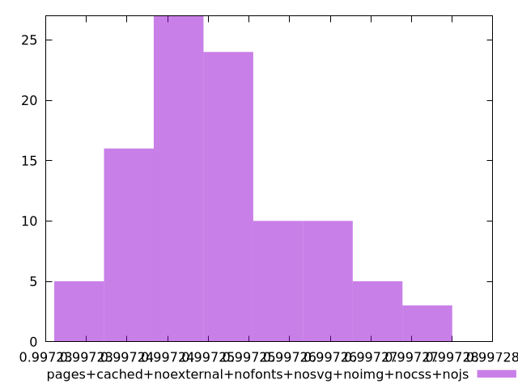
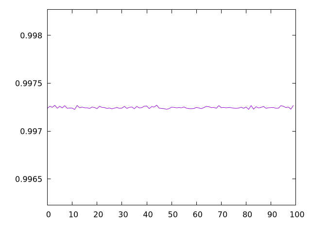

# Report pages+cached+noexternal+nofonts+nosvg+noimg+nocss+nojs

[parent..](./..)  


## Scores

  

## Score Histogram

  

## Score Indicators

```yaml
min: 0.9972267629320367
max: 0.9972713517597169
range: 0.000044588827680214216
mean: 0.9972463734439571
median: 0.997245127805968
stdev: 0.000010120517259284443
skewness: 0.5570544213206147
eccentricity: 1.5719967887975128
quanta: 99
quantaRatio: 0.99
p90range: 0.00003415206652723768
p90stdev: 0.99724413693514
p90eccentricity: 1.5719967887975128
p90quanta: 89
p90quantaRatio: 0.9888888888888889
outlandishness: 1.0000029990370944

```

## Raw Values

  

## Raw Values Histogram

  

## Raw Indicators

```yaml
min: 0.9972267629320367
max: 0.9972713517597169
range: 0.000044588827680214216
mean: 0.9972463734439571
median: 0.997245127805968
stdev: 0.000010120517259284443
skewness: 0.5570544213206147
eccentricity: 1.5719967887975128
quanta: 99
quantaRatio: 0.99
p90range: 0.00003415206652723768
p90stdev: 0.99724413693514
p90eccentricity: 1.5719967887975128
p90quanta: 89
p90quantaRatio: 0.9888888888888889
outlandishness: 1.0000029990370944

```

<style>
  img {
    max-width: 80%;
  }
</style>
      
