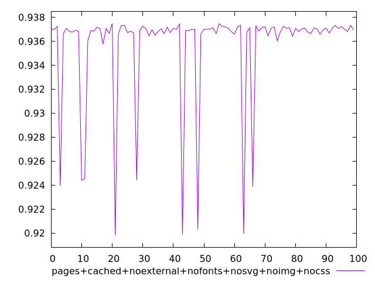
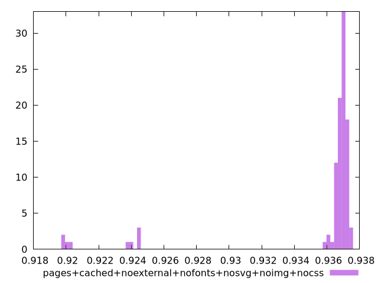
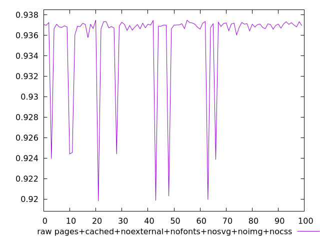

# Report pages+cached+noexternal+nofonts+nosvg+noimg+nocss

[parent..](./..)  


## Scores

  

## Score Histogram

  

## Score Indicators

```yaml
min: 0.9198022809900381
max: 0.9374868255315372
range: 0.017684544541499037
mean: 0.9356209904200443
median: 0.9369641702283643
stdev: 0.0042360933204483925
skewness: -2.9606764124584037
eccentricity: 0.7197300294676566
quanta: 100
quantaRatio: 1
p90range: 0.001710543535245579
p90stdev: 0.9369883919411897
p90eccentricity: 0.7197300294676566
p90quanta: 90
p90quantaRatio: 1
outlandishness: 0.9972104644418288

```

## Raw Values

  

## Raw Values Histogram

  

## Raw Indicators

```yaml
min: 0.9198022809900381
max: 0.9374868255315372
range: 0.017684544541499037
mean: 0.9356209904200443
median: 0.9369641702283643
stdev: 0.0042360933204483925
skewness: -2.9606764124584037
eccentricity: 0.7197300294676566
quanta: 100
quantaRatio: 1
p90range: 0.001710543535245579
p90stdev: 0.9369883919411897
p90eccentricity: 0.7197300294676566
p90quanta: 90
p90quantaRatio: 1
outlandishness: 0.9972104644418288

```

<style>
  img {
    max-width: 80%;
  }
</style>
      
