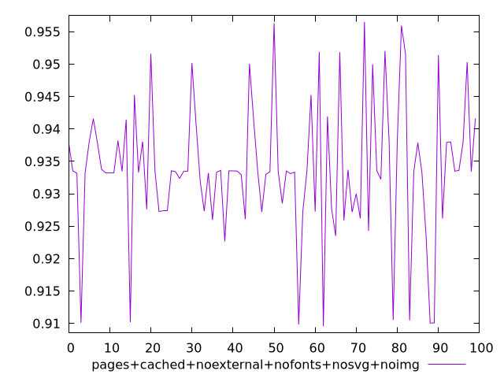
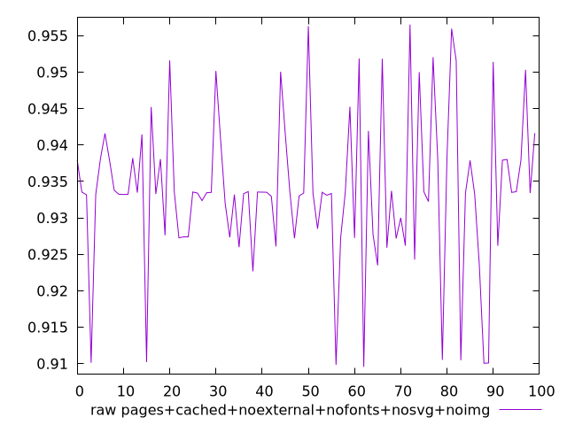

# Report pages+cached+noexternal+nofonts+nosvg+noimg

[parent..](./..)  


## Scores

  

## Score Histogram

  

## Score Indicators

```yaml
min: 0.909549516258911
max: 0.9565363384250842
range: 0.046986822166173225
mean: 0.9337428523371591
median: 0.9334392269858944
stdev: 0.010495919881572198
skewness: -0.18581807299486905
eccentricity: 1.3511896450270617
quanta: 100
quantaRatio: 1
p90range: 0.033299621398487966
p90stdev: 0.9335028740880941
p90eccentricity: 1.3511896450270617
p90quanta: 90
p90quantaRatio: 1
outlandishness: 0.9965884509608856

```

## Raw Values

  

## Raw Values Histogram

  

## Raw Indicators

```yaml
min: 0.909549516258911
max: 0.9565363384250842
range: 0.046986822166173225
mean: 0.9337428523371591
median: 0.9334392269858944
stdev: 0.010495919881572198
skewness: -0.18581807299486905
eccentricity: 1.3511896450270617
quanta: 100
quantaRatio: 1
p90range: 0.033299621398487966
p90stdev: 0.9335028740880941
p90eccentricity: 1.3511896450270617
p90quanta: 90
p90quantaRatio: 1
outlandishness: 0.9965884509608856

```

<style>
  img {
    max-width: 80%;
  }
</style>
      
