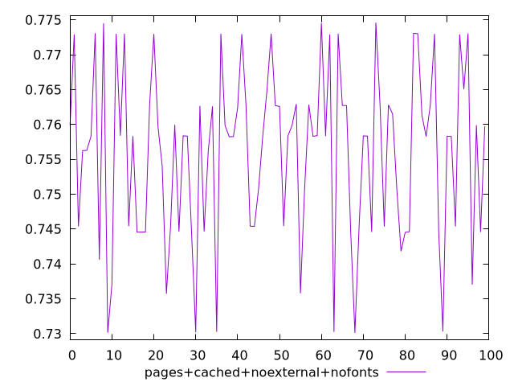
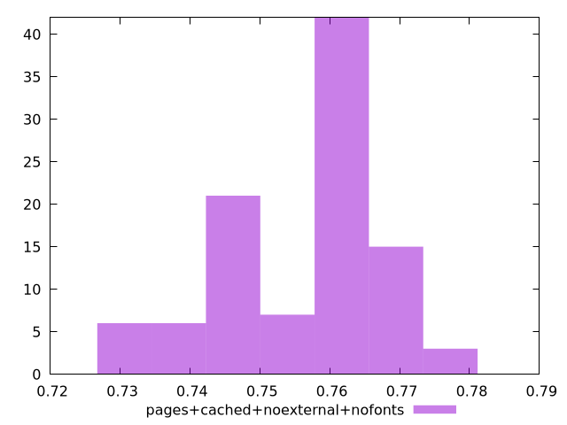
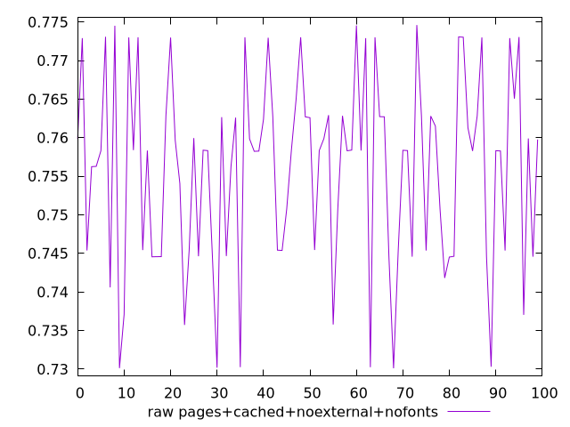

# Report pages+cached+noexternal+nofonts

[parent..](./..)  


## Scores

  

## Score Histogram

  

## Score Indicators

```yaml
min: 0.73011125244291
max: 0.7745950872913464
range: 0.04448383484843643
mean: 0.7558773617059137
median: 0.7583285929894171
stdev: 0.012261513170686524
skewness: -0.3459388381070245
eccentricity: 1.5751860828331823
quanta: 100
quantaRatio: 1
p90range: 0.03400012874803726
p90stdev: 0.7583820307899181
p90eccentricity: 1.5751860828331823
p90quanta: 90
p90quantaRatio: 1
outlandishness: 0.9932170473193173

```

## Raw Values

  

## Raw Values Histogram

  

## Raw Indicators

```yaml
min: 0.73011125244291
max: 0.7745950872913464
range: 0.04448383484843643
mean: 0.7558773617059137
median: 0.7583285929894171
stdev: 0.012261513170686524
skewness: -0.3459388381070245
eccentricity: 1.5751860828331823
quanta: 100
quantaRatio: 1
p90range: 0.03400012874803726
p90stdev: 0.7583820307899181
p90eccentricity: 1.5751860828331823
p90quanta: 90
p90quantaRatio: 1
outlandishness: 0.9932170473193173

```

<style>
  img {
    max-width: 80%;
  }
</style>
      
