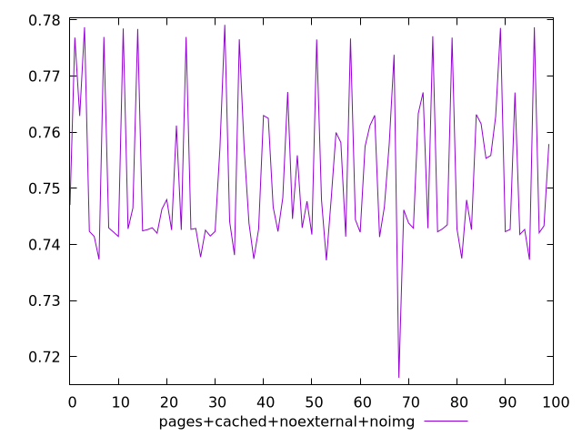
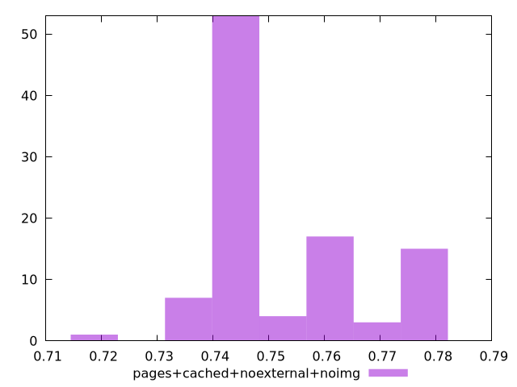
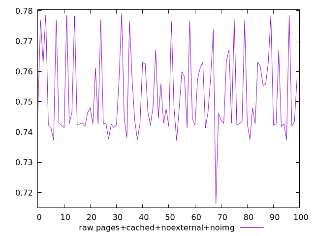

# Report pages+cached+noexternal+noimg

[parent..](./..)  


## Scores

  

## Score Histogram

  

## Score Indicators

```yaml
min: 0.7162280112814366
max: 0.7791282319335076
range: 0.0629002206520709
mean: 0.7519388196111982
median: 0.7453403960503422
stdev: 0.013600257706028358
skewness: 0.6725493609663102
eccentricity: 1.555403096483735
quanta: 100
quantaRatio: 1
p90range: 0.0397018878207267
p90stdev: 0.7437730912245988
p90eccentricity: 1.555403096483735
p90quanta: 90
p90quantaRatio: 1
outlandishness: 1.0059309734399147

```

## Raw Values

  

## Raw Values Histogram

  

## Raw Indicators

```yaml
min: 0.7162280112814366
max: 0.7791282319335076
range: 0.0629002206520709
mean: 0.7519388196111982
median: 0.7453403960503422
stdev: 0.013600257706028358
skewness: 0.6725493609663102
eccentricity: 1.555403096483735
quanta: 100
quantaRatio: 1
p90range: 0.0397018878207267
p90stdev: 0.7437730912245988
p90eccentricity: 1.555403096483735
p90quanta: 90
p90quantaRatio: 1
outlandishness: 1.0059309734399147

```

<style>
  img {
    max-width: 80%;
  }
</style>
      
