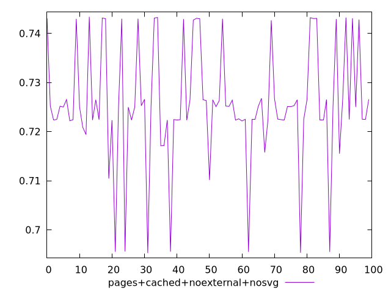
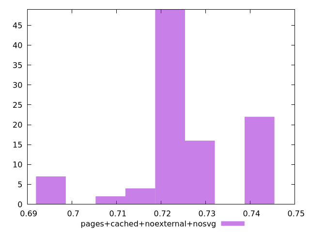
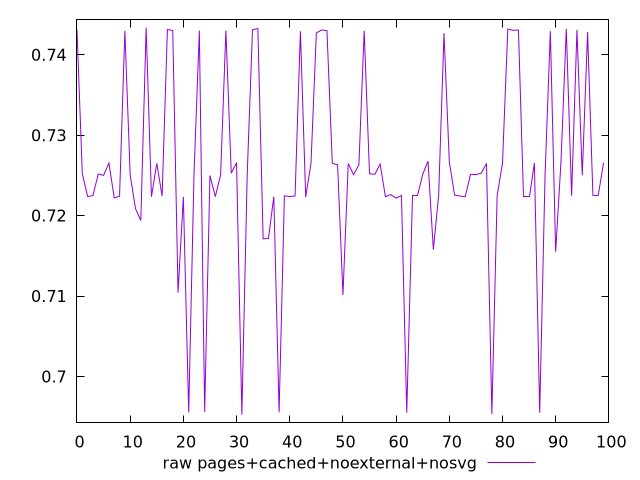

# Report pages+cached+noexternal+nosvg

[parent..](./..)  


## Scores

  

## Score Histogram

  

## Score Indicators

```yaml
min: 0.6952478887018282
max: 0.7433953975027573
range: 0.048147508800929106
mean: 0.7256832262449936
median: 0.7250516438163113
stdev: 0.01193313329701202
skewness: -0.5306428768462201
eccentricity: 1.3049797124131808
quanta: 100
quantaRatio: 1
p90range: 0.03306705445543656
p90stdev: 0.725094302140888
p90eccentricity: 1.3049797124131808
p90quanta: 90
p90quantaRatio: 1
outlandishness: 0.9951559494381844

```

## Raw Values

  

## Raw Values Histogram

  

## Raw Indicators

```yaml
min: 0.6952478887018282
max: 0.7433953975027573
range: 0.048147508800929106
mean: 0.7256832262449936
median: 0.7250516438163113
stdev: 0.01193313329701202
skewness: -0.5306428768462201
eccentricity: 1.3049797124131808
quanta: 100
quantaRatio: 1
p90range: 0.03306705445543656
p90stdev: 0.725094302140888
p90eccentricity: 1.3049797124131808
p90quanta: 90
p90quantaRatio: 1
outlandishness: 0.9951559494381844

```

<style>
  img {
    max-width: 80%;
  }
</style>
      
