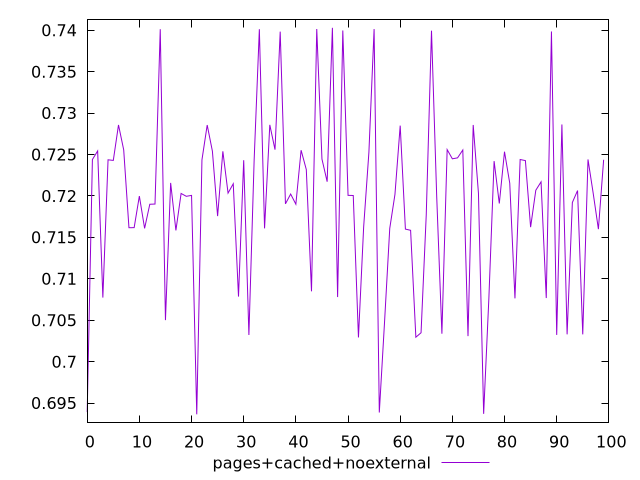
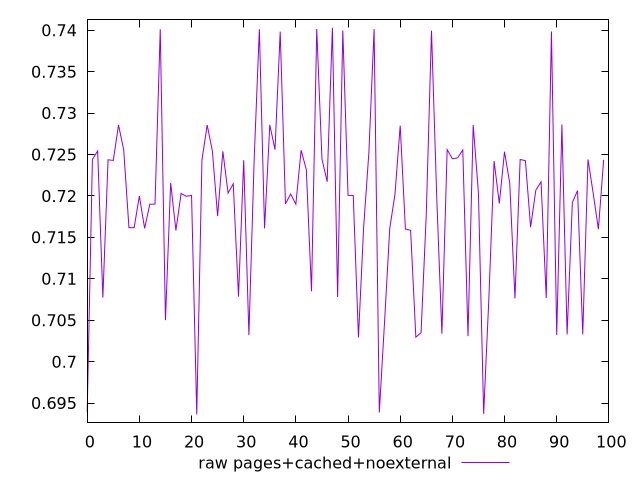
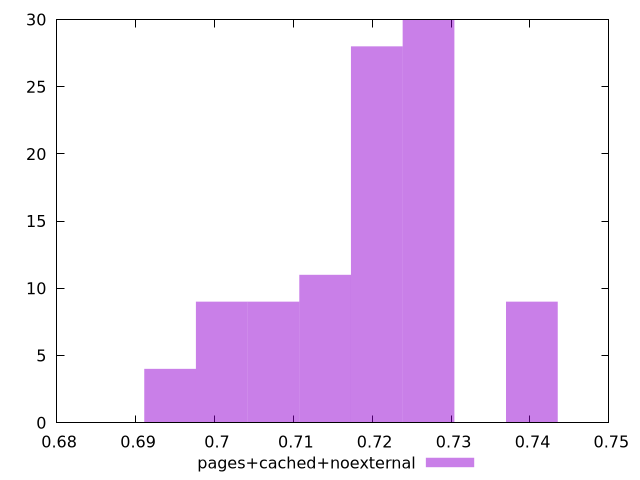

# Report pages+cached+noexternal

[parent..](./..)  


## Scores

  

## Score Histogram

  

## Score Indicators

```yaml
min: 0.693633431382311
max: 0.7403007450655116
range: 0.04666731368320054
mean: 0.719370891651772
median: 0.72030690010244
stdev: 0.01076232921684792
skewness: -0.27224017134394424
eccentricity: 1.459880943080256
quanta: 100
quantaRatio: 1
p90range: 0.03702623917576375
p90stdev: 0.7202665260116348
p90eccentricity: 1.459880943080256
p90quanta: 90
p90quantaRatio: 1
outlandishness: 1.000687047830016

```

## Raw Values

  

## Raw Values Histogram

  

## Raw Indicators

```yaml
min: 0.693633431382311
max: 0.7403007450655116
range: 0.04666731368320054
mean: 0.719370891651772
median: 0.72030690010244
stdev: 0.01076232921684792
skewness: -0.27224017134394424
eccentricity: 1.459880943080256
quanta: 100
quantaRatio: 1
p90range: 0.03702623917576375
p90stdev: 0.7202665260116348
p90eccentricity: 1.459880943080256
p90quanta: 90
p90quantaRatio: 1
outlandishness: 1.000687047830016

```

<style>
  img {
    max-width: 80%;
  }
</style>
      
