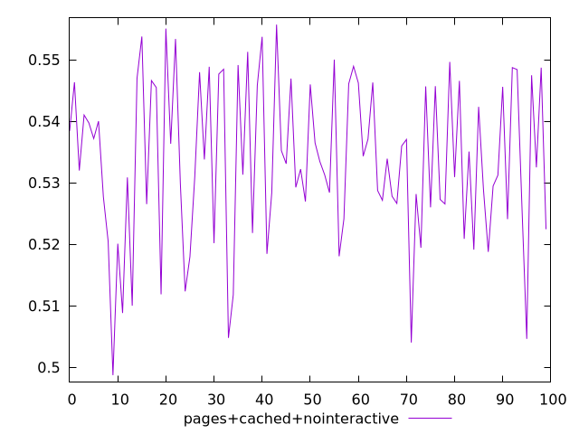
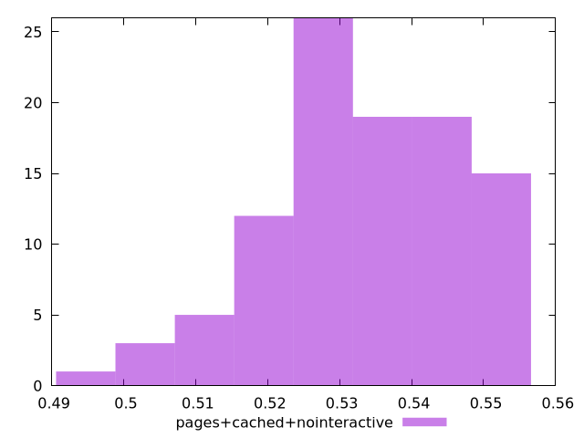
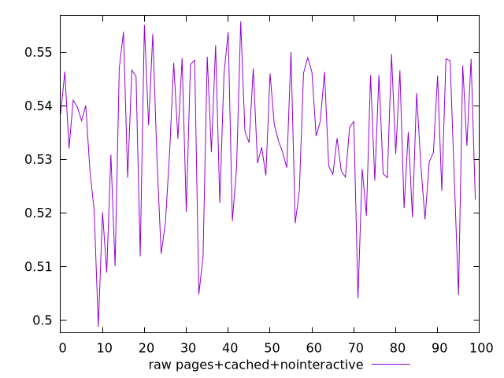

# Report pages+cached+nointeractive

[parent..](./..)  


## Scores

  

## Score Histogram

  

## Score Indicators

```yaml
min: 0.4987142483890919
max: 0.5557012301041877
range: 0.05698698171509581
mean: 0.5334921907021536
median: 0.5327911364534887
stdev: 0.013116735218975996
skewness: -0.384374384692772
eccentricity: 1.6432503328824937
quanta: 100
quantaRatio: 1
p90range: 0.04143826356818037
p90stdev: 0.5338431346108046
p90eccentricity: 1.6432503328824937
p90quanta: 90
p90quantaRatio: 1
outlandishness: 0.992973164476942

```

## Raw Values

  

## Raw Values Histogram

  

## Raw Indicators

```yaml
min: 0.4987142483890919
max: 0.5557012301041877
range: 0.05698698171509581
mean: 0.5334921907021536
median: 0.5327911364534887
stdev: 0.013116735218975996
skewness: -0.384374384692772
eccentricity: 1.6432503328824937
quanta: 100
quantaRatio: 1
p90range: 0.04143826356818037
p90stdev: 0.5338431346108046
p90eccentricity: 1.6432503328824937
p90quanta: 90
p90quantaRatio: 1
outlandishness: 0.992973164476942

```

<style>
  img {
    max-width: 80%;
  }
</style>
      
